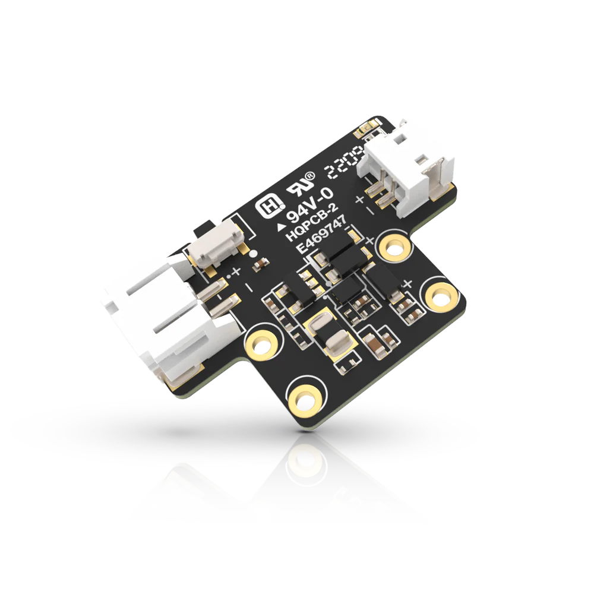

.. _rakwireless_rak19013:

RAK19013 WisBlock LiPo Solar Power Slot Module
##############################################

Overview
********

The RAK19013 WisBlock LiPo Solar module is a power board comprising a battery connector,
a solar panel connector, a reset push button, a charger that can recharge a plugged-in
battery, a charging LED indicating charging status, and a power connector for connection
with a WisBlock Base board.

This board connects to a WisBlock Base board, such as the RAK19010, via the power slot.

   RAK19013 WisBlock LiPo Solar Power Slot Module (Credit: RAKwireless)

Product Features
****************

- Flexible building-block design enabling modular function realization and expansion.
- Low-power battery power supply.
- Supports lithium-ion battery charging.
- Supports solar charging.
- Meets industrial-level design requirements.
- Module Size: 30 mm x 20 mm

More information about the shield can be found at
`RAK19013 WisBlock LiPo Solar Power Slot Module`_.

Requirements
************

RAK19013 WisBlock LiPo Solar Power Slot Module is a power board that can be used
with any WisBlock Base board that has a Power Slot. It is compatible with almost all
WisBlock Base boards, but the features available depend on the specific WisBlock Base
board used.

Supported WisBlock Base boards

- RAK19009
- RAK19010
- RAK19011

Mounting
********

The RAK19013 module can be mounted on the power slot of a WisBlock Base board with a power slot.

The mounting guide for RAK19013 can be found at `RAK19013 WisBlock Assembly Guide`_.

Pin Assignments
***************

WisBlock Power Module Connector Pin Assignments

+-------------+----------+-----+-----+----------+-------------+
| Used        | A        | Pin | Pin | A        | Used        |
+-------------+----------+-----+-----+----------+-------------+
| VBAT        | VBAT     | 1   | 2   | VBAT     | VBAT        |
+-------------+----------+-----+-----+----------+-------------+
| GND         | GND      | 3   | 4   | GND      | GND         |
+-------------+----------+-----+-----+----------+-------------+
| 3V3         | 3V3      | 5   | 6   | 3V3      | 3V3         |
+-------------+----------+-----+-----+----------+-------------+
|             | USB_P    | 7   | 8   | USB_N    |             |
+-------------+----------+-----+-----+----------+-------------+
|             | VBUS     | 9   | 10  | SW1      |             |
+-------------+----------+-----+-----+----------+-------------+
|             | TXD0     | 11  | 12  | RXD0     |             |
+-------------+----------+-----+-----+----------+-------------+
| RESET       | RESET    | 13  | 14  | LED1     | LED1        |
+-------------+----------+-----+-----+----------+-------------+
| LED2        | LED2     | 15  | 16  | LED3     |             |
+-------------+----------+-----+-----+----------+-------------+
|             | VDD      | 17  | 18  | VDD      |             |
+-------------+----------+-----+-----+----------+-------------+
|             | I2C1_SDA | 19  | 20  | I2C1_SCL |             |
+-------------+----------+-----+-----+----------+-------------+
| ADC_VBAT    | AIN0     | 21  | 22  | AIN1     |             |
+-------------+----------+-----+-----+----------+-------------+
|             | BOOT0    | 23  | 24  | IO7      |             |
+-------------+----------+-----+-----+----------+-------------+
|             | SPI_CS   | 25  | 26  | SPI_CLK  |             |
+-------------+----------+-----+-----+----------+-------------+
|             | SPI_MISO | 27  | 28  | SPI_MOSI |             |
+-------------+----------+-----+-----+----------+-------------+
|             | IO1      | 29  | 30  | IO2      |             |
+-------------+----------+-----+-----+----------+-------------+
|             | IO3      | 31  | 32  | IO4      |             |
+-------------+----------+-----+-----+----------+-------------+
|             | TXD1     | 33  | 34  | RXD1     |             |
+-------------+----------+-----+-----+----------+-------------+
|             | I2C2_SDA | 35  | 36  | I2C2_SCL |             |
+-------------+----------+-----+-----+----------+-------------+
|             | IO5      | 37  | 38  | IO6      |             |
+-------------+----------+-----+-----+----------+-------------+
|             | GND      | 39  | 40  | GND      |             |
+-------------+----------+-----+-----+----------+-------------+

Programming
***********

Set ``--shield rakwireless_rak19013`` when you invoke ``west build``,
for example:

.. zephyr-app-commands::
   :zephyr-app: samples/drivers/fuel_gauge
   :board: rak4631/nrf52840
   :shield: rakwireless_rak19010,rakwireless_rak19013
   :snippets: wisblock-console-uart1
   :goals: build flash

References
**********

.. target-notes::

.. _RAK19013 WisBlock Assembly Guide:
   https://docs.rakwireless.com/product-categories/wisblock/rak19013/quickstart/#assembling-a-wisblock-module

.. _RAK19013 WisBlock LiPo Solar Power Slot Module:
   https://docs.rakwireless.com/product-categories/wisblock/rak19013
