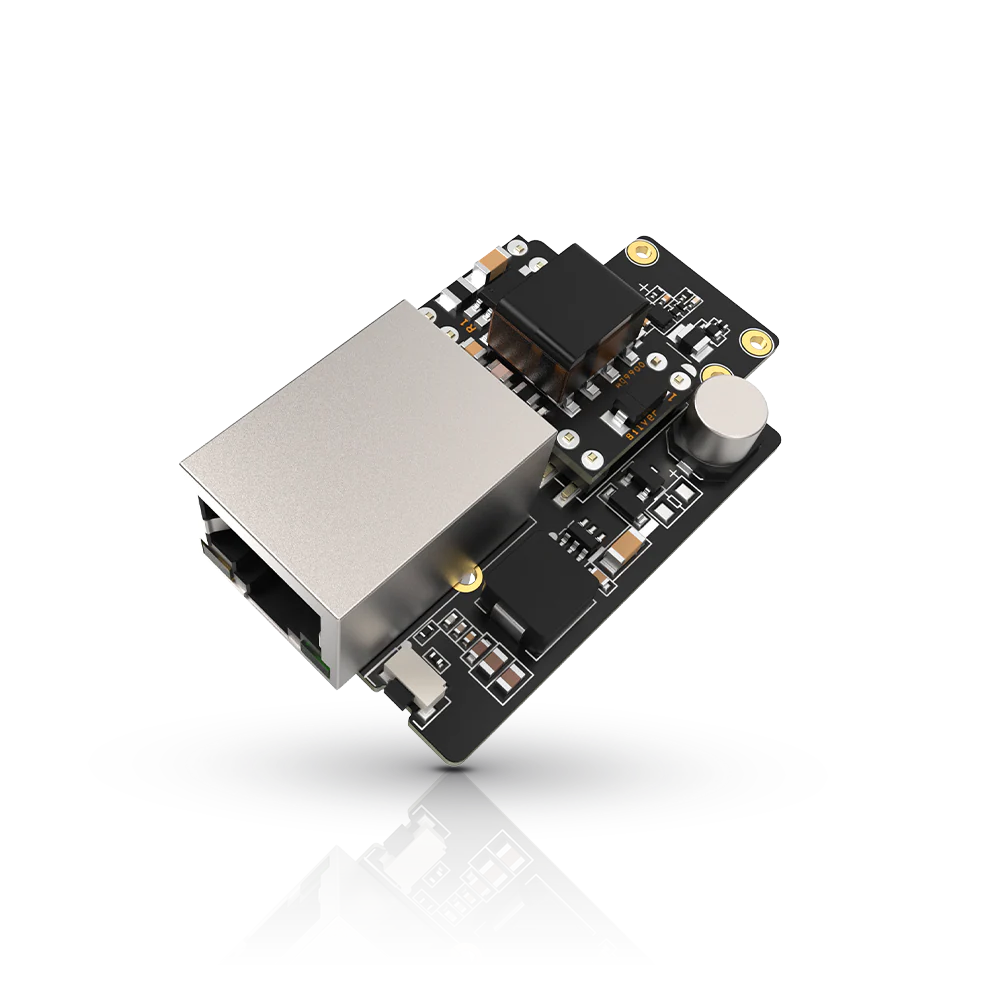

.. _rakwireless_rak19017:

RAK19017 WisBlock POE Slot Module
#################################

Overview
********

The RAK19017 is a WisBlock POE Power Slot Module that has an Ethernet
connector with POE (power supply only, no Ethernet connection) capability
and a reset button. It is compatible with the WisBlock Base board with
Power Slot.

The RAK19017 WisBlock POE module is a power board that is designed based
on Ag9905MT from Silvertel. RAK19017 Wisblock POE module is an IEEE 802.3af
compliant POE module that can draw power from the conventional twisted pair
CAT5 ethernet cable. This circuit provides the necessary signature required
by the Power Sourcing Equipment (PSE) before delivering up to 9 W of power
to the port. The Ag9905MT provides a regulated 5 V output from the internal
DC-DC converter that has a built-in short-circuit output protection.

   RAK19017 WisBlock POE Power Slot Module (Credit: RAKwireless)

Product Features
****************

- POE Power Module (power supply only, no Ethernet connection capability)
- 36 V to 57 V Input voltage range
- Short-circuit protection and Over temperature protection
- Compact size, the minimum size is: 30 x 50 mm

More information about the shield can be found at
`RAK19017 WisBlock POE Slot Module`_.

Requirements
************

RAK19017 WisBlock POE Slot Module is a power board that can be used
with any WisBlock Base board that has a Power Slot. It is compatible with almost all
WisBlock Base boards, but the features available depend on the specific WisBlock Base
board used.

Supported WisBlock Base boards

- RAK19009
- RAK19010
- RAK19011

Mounting
********

The RAK19017 module can be mounted on the power slot of a WisBlock Base board with a power slot.

The mounting guide for RAK19017 can be found at `RAK19017 WisBlock Assembly Guide`_.

Pin Assignments
***************

WisBlock Power Module Connector Pin Assignments

+-------------+----------+-----+-----+----------+-------------+
| Used        | A        | Pin | Pin | A        | Used        |
+-------------+----------+-----+-----+----------+-------------+
| VBAT        | VBAT     | 1   | 2   | VBAT     | VBAT        |
+-------------+----------+-----+-----+----------+-------------+
| GND         | GND      | 3   | 4   | GND      | GND         |
+-------------+----------+-----+-----+----------+-------------+
| 3V3         | 3V3      | 5   | 6   | 3V3      | 3V3         |
+-------------+----------+-----+-----+----------+-------------+
|             | USB_P    | 7   | 8   | USB_N    |             |
+-------------+----------+-----+-----+----------+-------------+
|             | VBUS     | 9   | 10  | SW1      |             |
+-------------+----------+-----+-----+----------+-------------+
|             | TXD0     | 11  | 12  | RXD0     |             |
+-------------+----------+-----+-----+----------+-------------+
| RESET       | RESET    | 13  | 14  | LED1     | LED1        |
+-------------+----------+-----+-----+----------+-------------+
| LED2        | LED2     | 15  | 16  | LED3     |             |
+-------------+----------+-----+-----+----------+-------------+
|             | VDD      | 17  | 18  | VDD      |             |
+-------------+----------+-----+-----+----------+-------------+
|             | I2C1_SDA | 19  | 20  | I2C1_SCL |             |
+-------------+----------+-----+-----+----------+-------------+
| ADC_VBAT    | AIN0     | 21  | 22  | AIN1     |             |
+-------------+----------+-----+-----+----------+-------------+
|             | BOOT0    | 23  | 24  | IO7      |             |
+-------------+----------+-----+-----+----------+-------------+
|             | SPI_CS   | 25  | 26  | SPI_CLK  |             |
+-------------+----------+-----+-----+----------+-------------+
|             | SPI_MISO | 27  | 28  | SPI_MOSI |             |
+-------------+----------+-----+-----+----------+-------------+
|             | IO1      | 29  | 30  | IO2      |             |
+-------------+----------+-----+-----+----------+-------------+
|             | IO3      | 31  | 32  | IO4      |             |
+-------------+----------+-----+-----+----------+-------------+
|             | TXD1     | 33  | 34  | RXD1     |             |
+-------------+----------+-----+-----+----------+-------------+
|             | I2C2_SDA | 35  | 36  | I2C2_SCL |             |
+-------------+----------+-----+-----+----------+-------------+
|             | IO5      | 37  | 38  | IO6      |             |
+-------------+----------+-----+-----+----------+-------------+
|             | GND      | 39  | 40  | GND      |             |
+-------------+----------+-----+-----+----------+-------------+

Programming
***********

Set ``--shield rakwireless_rak19017`` when you invoke ``west build``,
for example:

.. zephyr-app-commands::
   :zephyr-app: samples/basic/blinky
   :board: rak4631/nrf52840
   :shield: rakwireless_rak19010,rakwireless_rak19017
   :goals: build flash

References
**********

.. target-notes::

.. _RAK19017 WisBlock Assembly Guide:
   https://docs.rakwireless.com/product-categories/wisblock/rak19017/quickstart/#assembling-a-wisblock-module

.. _RAK19017 WisBlock POE Slot Module:
   https://docs.rakwireless.com/product-categories/wisblock/rak19017
