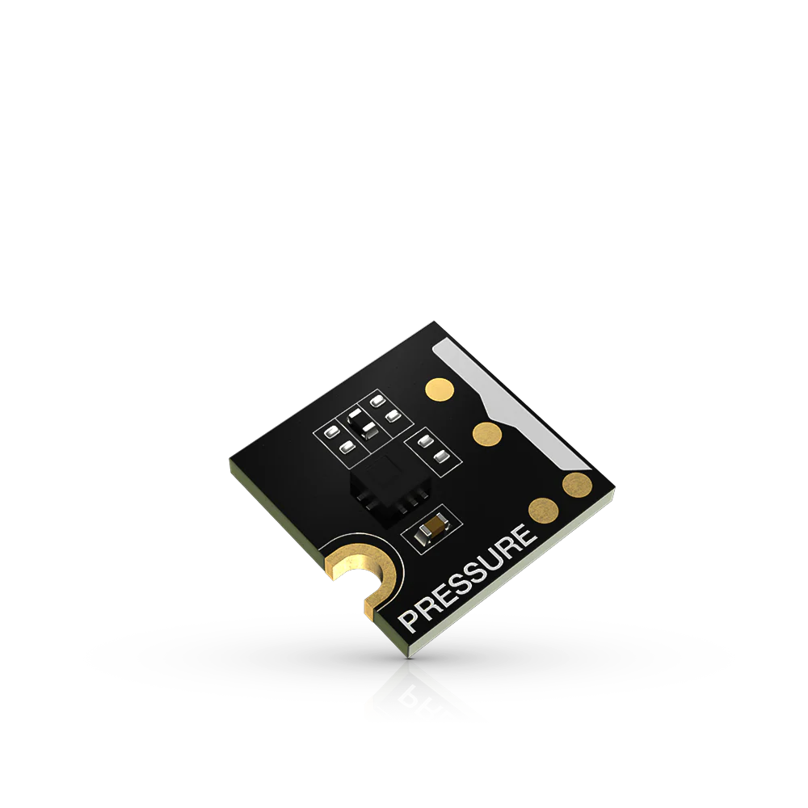

.. _rakwireless_rak1902:

RAK1902 WisBlock Barometer Pressure Sensor Module
#################################################

Overview
********

The RAK1902 WisBlock Barometer Pressure Sensor Module,
part of the RAK Wireless WisBlock series, is an ultra-compact
piezo-resistive pressure sensor that functions as a digital
barometer with an I2C interface. The sensing element, which
detects absolute pressure, consists of a suspended membrane
manufactured through a delicate process developed by ST®.
The pressure measurement covers the range from 260 hPa to
1260 hPa and the temperature measurement covers the range
from -40 °C to 85 °C. Measurements accuracy is ±0.1 hPa
for pressure and ±1.5 °C for temperature.

   RAK1902 WisBlock Barometer Pressure Sensor Module (Credit: RAKwireless)

Product Features
****************

- Sensor specifications
   - 260-1260 hPa measurement range
   - ±0.1 hPa accuracy
   - -40 °C to +85 °C temperature range
   - ±1.5 °C temperature accuracy
   - Voltage Supply: 3.3 V
   - Current Consumption: 1 uA to 12 uA
   - Chipset: ST LPS22HB
- Size
   - 10 x 10 mm

More information about the shield can be found at
`RAK1902 WisBlock Barometer Pressure Sensor Module`_.

Requirements
************

To use a RAK1902, you need at least a WisBlock Base to plug
the module in. WisBlock Base provides power supply to the
RAK1902 module. Furthermore, you need a WisBlock Core module
to use the RAK1902.

Mounting
********

The figure shows the mounting mechanism of the RAK1902 module
on a WisBlock Base board. The RAK1902 module can be mounted
on the slots: A, B, C, D, E, & F.

.. figure:: img/mounting.webp
   :align: center
   :alt: RAK1902 WisBlock Sensor Mounting

   RAK1902 WisBlock Sensor Mounting (Credit: RAKwireless)

The mounting guide for RAK1902 can be found at `RAK1902 WisBlock Assembly Guide`_.

Pin Assignments
***************

WisBlock Sensor Slot A-C Pin Assignments

+-------------+----------+----------+----------+-----+-----+----------+----------+----------+-------------+
| Used        | C        | B        | A        | Pin | Pin | A        | B        | C        | Used        |
+-------------+----------+----------+----------+-----+-----+----------+----------+----------+-------------+
|             | NC       | NC       | TXD0     | 1   | 2   | GND      | GND      | GND      |             |
+-------------+----------+----------+----------+-----+-----+----------+----------+----------+-------------+
|             | SPI_CS   | SPI_CS   | SPI_CS   | 3   | 4   | SPI_CS   | SPI_CS   | SPI_CS   |             |
+-------------+----------+----------+----------+-----+-----+----------+----------+----------+-------------+
|             | SPI_MISO | SPI_MISO | SPI_MISO | 5   | 6   | SPI_MOSI | SPI_MOSI | SPI_MOSI |             |
+-------------+----------+----------+----------+-----+-----+----------+----------+----------+-------------+
| SCL         | I2C1_SCL | I2C1_SCL | I2C1_SCL | 7   | 8   | I2C1_SDA | I2C1_SDA | I2C1_SDA | SDA (0x5C)  |
+-------------+----------+----------+----------+-----+-----+----------+----------+----------+-------------+
|             | VDD      | VDD      | VDD      | 9   | 10  | IO2      | IO1      | IO4      |             |
+-------------+----------+----------+----------+-----+-----+----------+----------+----------+-------------+
|             | 3V3      | 3V3      | 3V3      | 11  | 12  | IO1      | IO2      | IO3      |             |
+-------------+----------+----------+----------+-----+-----+----------+----------+----------+-------------+
|             | NC       | NC       | NC       | 13  | 14  | 3V3      | 3V3      | 3V3      |             |
+-------------+----------+----------+----------+-----+-----+----------+----------+----------+-------------+
|             | NC       | NC       | NC       | 15  | 16  | VDD      | VDD      | VDD      |             |
+-------------+----------+----------+----------+-----+-----+----------+----------+----------+-------------+
|             | NC       | NC       | NC       | 17  | 18  | NC       | NC       | NC       |             |
+-------------+----------+----------+----------+-----+-----+----------+----------+----------+-------------+
|             | NC       | NC       | NC       | 19  | 20  | NC       | NC       | NC       |             |
+-------------+----------+----------+----------+-----+-----+----------+----------+----------+-------------+
|             | NC       | NC       | NC       | 21  | 22  | NC       | NC       | NC       |             |
+-------------+----------+----------+----------+-----+-----+----------+----------+----------+-------------+
|             | GND      | GND      | GND      | 23  | 24  | RXD0     | NC       | NC       |             |
+-------------+----------+----------+----------+-----+-----+----------+----------+----------+-------------+

WisBlock Sensor Slot D-F Pin Assignments

+------------+----------+----------+----------+-----+-----+----------+----------+----------+------------+
| Used       | F        | E        | D        | Pin | Pin | D        | E        | F        | Used       |
+------------+----------+----------+----------+-----+-----+----------+----------+----------+------------+
|            | TXD1     | TXD0     | NC       | 1   | 2   | GND      | GND      | GND      |            |
+------------+----------+----------+----------+-----+-----+----------+----------+----------+------------+
|            | SPI_CS   | SPI_CS   | SPI_CS   | 3   | 4   | SPI_CS   | SPI_CS   | SPI_CS   |            |
+------------+----------+----------+----------+-----+-----+----------+----------+----------+------------+
|            | SPI_MISO | SPI_MISO | SPI_MISO | 5   | 6   | SPI_MOSI | SPI_MOSI | SPI_MOSI |            |
+------------+----------+----------+----------+-----+-----+----------+----------+----------+------------+
| SCL        | I2C1_SCL | I2C1_SCL | I2C1_SCL | 7   | 8   | I2C1_SDA | I2C1_SDA | I2C1_SDA | SDA (0x5C) |
+------------+----------+----------+----------+-----+-----+----------+----------+----------+------------+
|            | VDD      | VDD      | VDD      | 9   | 10  | IO6      | IO3      | IO5      |            |
+------------+----------+----------+----------+-----+-----+----------+----------+----------+------------+
|            | 3V3      | 3V3      | 3V3      | 11  | 12  | IO5      | IO4      | IO6      |            |
+------------+----------+----------+----------+-----+-----+----------+----------+----------+------------+
|            | NC       | NC       | NC       | 13  | 14  | 3V3      | 3V3      | 3V3      |            |
+------------+----------+----------+----------+-----+-----+----------+----------+----------+------------+
|            | NC       | NC       | NC       | 15  | 16  | VDD      | VDD      | VDD      |            |
+------------+----------+----------+----------+-----+-----+----------+----------+----------+------------+
|            | NC       | NC       | NC       | 17  | 18  | NC       | NC       | NC       |            |
+------------+----------+----------+----------+-----+-----+----------+----------+----------+------------+
|            | NC       | NC       | NC       | 19  | 20  | NC       | NC       | NC       |            |
+------------+----------+----------+----------+-----+-----+----------+----------+----------+------------+
|            | NC       | NC       | NC       | 21  | 22  | NC       | NC       | NC       |            |
+------------+----------+----------+----------+-----+-----+----------+----------+----------+------------+
|            | GND      | GND      | GND      | 23  | 24  | NC       | RXD0     | RXD1     |            |
+------------+----------+----------+----------+-----+-----+----------+----------+----------+------------+

Programming
***********

Set ``--shield rakwireless_rak1902`` when you invoke ``west build``,
for example:

.. zephyr-app-commands::
   :zephyr-app: samples/sensor/sensor_shell
   :board: rak11722/apollo3_blue
   :shield: rakwireless_rak19007,rakwireless_rak1902
   :goals: build flash

References
**********

.. target-notes::

.. _RAK1902 WisBlock Assembly Guide:
   https://docs.rakwireless.com/product-categories/wisblock/rak1902/quickstart/#assembling-a-wisblock-module

.. _RAK1902 WisBlock Barometer Pressure Sensor Module:
   https://docs.rakwireless.com/product-categories/wisblock/rak1902/overview
