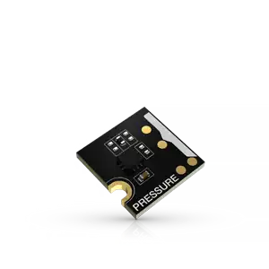

.. _rakwireless_rak1902:

RAK1902 WisBlock Barometer Pressure Sensor
##########################################

Overview
********

RAK1902 is a WisBlock sensor module built around the ST LPS22HB
barometric pressure sensor. It connects to the WisBlock sensor I2C bus
at address ``0x5c``. The interrupt output follows the sensor slot GPIO
and is not described in this overlay.

   RAK1902 WisBlock Barometer Pressure Sensor (Credit: RAKwireless)

More information about the module can be found at
`RAK1902 WisBlock Barometer Pressure Sensor`_.

Requirements
************

This shield requires a WisBlock core that provides the ``wisblock_i2c1``
connector, for example ``rak4631/nrf52840``. The core is mounted on a WisBlock
base board such as the RAK19007.

Programming
***********

Set ``--shield rakwireless_rak1902`` when you invoke ``west build``. For example
when running the :zephyr:code-sample:`pressure_polling` sample:

.. zephyr-app-commands::
   :zephyr-app: samples/sensor/pressure_polling
   :board: rak4631/nrf52840
   :shield: rakwireless_rak1902
   :goals: build

.. _RAK1902 WisBlock Barometer Pressure Sensor:
   https://docs.rakwireless.com/product-categories/wisblock/rak1902
