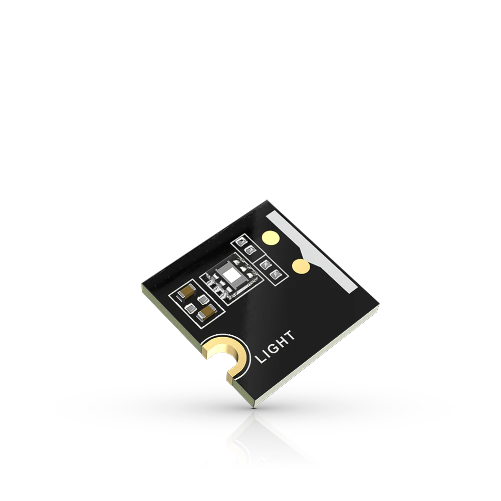

.. _rakwireless_rak1903:

RAK1903 WisBlock Ambient Light Sensor Module
############################################

Overview
********

The RAK1903 WisBlock Ambient Light Sensor Module, part of
the RAK Wireless Wisblock series, is a single-chip ambient
light sensor, measuring the intensity of light in the
visible range. The precise spectral response and strong
IR rejection of the device enables the RAK1903 module to
accurately measure the intensity of light as seen by human
eyes regardless of light sources. The strong IR rejection
also aids in maintaining high accuracy when the industrial
design requires to mount the sensor under dark glass due
to aesthetic reasons. The RAK1903 module is designed for
systems that create light-based experiences for humans.
It is an ideal replacement for photodiodes, photoresistors,
or other ambient light sensors with less visible range
matching and IR rejection.

   RAK1903 WisBlock Ambient Light Sensor Module (Credit: RAKwireless)

Product Features
****************

- Sensor specifications
   - 0.01 to 83865 lux measurement range
   - Optical filtering to match human eye
   - Voltage Supply: 3.3 V
   - Current Consumption: 0.4 uA to 3.7 uA
   - Chipset: TI OPT3001DNPR
- Size
   - 10 x 10 mm

More information about the shield can be found at
`RAK1903 WisBlock Ambient Light Sensor Module`_.

Requirements
************

To use a RAK1903, you need at least a WisBlock Base to plug
the module in. WisBlock Base provides power supply to the
RAK1903 module. Furthermore, you need a WisBlock Core module
to use the sensor.

Mounting
********

The figure shows the mounting mechanism of the RAK1903 module
on a WisBlock Base board. The RAK1903 module can be mounted
on the slots: A, C, D, E, & F.

.. figure:: img/mounting.webp
   :align: center
   :alt: RAK1903 WisBlock Sensor Mounting

   RAK1903 WisBlock Sensor Mounting (Credit: RAKwireless)

The mounting guide for RAK1903 can be found at `RAK1903 WisBlock Assembly Guide`_.

Pin Assignments
***************

WisBlock Sensor Slot A-C Pin Assignments

+-------------+----------+----------+----------+-----+-----+----------+----------+----------+-------------+
| Used        | C        | B        | A        | Pin | Pin | A        | B        | C        | Used        |
+-------------+----------+----------+----------+-----+-----+----------+----------+----------+-------------+
|             | NC       | NC       | TXD0     | 1   | 2   | GND      | GND      | GND      |             |
+-------------+----------+----------+----------+-----+-----+----------+----------+----------+-------------+
|             | SPI_CS   | SPI_CS   | SPI_CS   | 3   | 4   | SPI_CS   | SPI_CS   | SPI_CS   |             |
+-------------+----------+----------+----------+-----+-----+----------+----------+----------+-------------+
|             | SPI_MISO | SPI_MISO | SPI_MISO | 5   | 6   | SPI_MOSI | SPI_MOSI | SPI_MOSI |             |
+-------------+----------+----------+----------+-----+-----+----------+----------+----------+-------------+
| SCL         | I2C1_SCL | I2C1_SCL | I2C1_SCL | 7   | 8   | I2C1_SDA | I2C1_SDA | I2C1_SDA | SDA (0x44)  |
+-------------+----------+----------+----------+-----+-----+----------+----------+----------+-------------+
|             | VDD      | VDD      | VDD      | 9   | 10  | IO2      | IO1      | IO4      |             |
+-------------+----------+----------+----------+-----+-----+----------+----------+----------+-------------+
|             | 3V3      | 3V3      | 3V3      | 11  | 12  | IO1      | IO2      | IO3      | INT         |
+-------------+----------+----------+----------+-----+-----+----------+----------+----------+-------------+
|             | NC       | NC       | NC       | 13  | 14  | 3V3      | 3V3      | 3V3      |             |
+-------------+----------+----------+----------+-----+-----+----------+----------+----------+-------------+
|             | NC       | NC       | NC       | 15  | 16  | VDD      | VDD      | VDD      |             |
+-------------+----------+----------+----------+-----+-----+----------+----------+----------+-------------+
|             | NC       | NC       | NC       | 17  | 18  | NC       | NC       | NC       |             |
+-------------+----------+----------+----------+-----+-----+----------+----------+----------+-------------+
|             | NC       | NC       | NC       | 19  | 20  | NC       | NC       | NC       |             |
+-------------+----------+----------+----------+-----+-----+----------+----------+----------+-------------+
|             | NC       | NC       | NC       | 21  | 22  | NC       | NC       | NC       |             |
+-------------+----------+----------+----------+-----+-----+----------+----------+----------+-------------+
|             | GND      | GND      | GND      | 23  | 24  | RXD0     | NC       | NC       |             |
+-------------+----------+----------+----------+-----+-----+----------+----------+----------+-------------+

WisBlock Sensor Slot D-F Pin Assignments

+-------------+----------+----------+----------+-----+-----+----------+----------+----------+-------------+
| Used        | F        | E        | D        | Pin | Pin | D        | E        | F        | Used        |
+-------------+----------+----------+----------+-----+-----+----------+----------+----------+-------------+
|             | TXD1     | TXD0     | NC       | 1   | 2   | GND      | GND      | GND      |             |
+-------------+----------+----------+----------+-----+-----+----------+----------+----------+-------------+
|             | SPI_CS   | SPI_CS   | SPI_CS   | 3   | 4   | SPI_CS   | SPI_CS   | SPI_CS   |             |
+-------------+----------+----------+----------+-----+-----+----------+----------+----------+-------------+
|             | SPI_MISO | SPI_MISO | SPI_MISO | 5   | 6   | SPI_MOSI | SPI_MOSI | SPI_MOSI |             |
+-------------+----------+----------+----------+-----+-----+----------+----------+----------+-------------+
| SCL         | I2C1_SCL | I2C1_SCL | I2C1_SCL | 7   | 8   | I2C1_SDA | I2C1_SDA | I2C1_SDA | SDA (0x44)  |
+-------------+----------+----------+----------+-----+-----+----------+----------+----------+-------------+
|             | VDD      | VDD      | VDD      | 9   | 10  | IO6      | IO3      | IO5      |             |
+-------------+----------+----------+----------+-----+-----+----------+----------+----------+-------------+
|             | 3V3      | 3V3      | 3V3      | 11  | 12  | IO5      | IO4      | IO6      | INT         |
+-------------+----------+----------+----------+-----+-----+----------+----------+----------+-------------+
|             | NC       | NC       | NC       | 13  | 14  | 3V3      | 3V3      | 3V3      |             |
+-------------+----------+----------+----------+-----+-----+----------+----------+----------+-------------+
|             | NC       | NC       | NC       | 15  | 16  | VDD      | VDD      | VDD      |             |
+-------------+----------+----------+----------+-----+-----+----------+----------+----------+-------------+
|             | NC       | NC       | NC       | 17  | 18  | NC       | NC       | NC       |             |
+-------------+----------+----------+----------+-----+-----+----------+----------+----------+-------------+
|             | NC       | NC       | NC       | 19  | 20  | NC       | NC       | NC       |             |
+-------------+----------+----------+----------+-----+-----+----------+----------+----------+-------------+
|             | NC       | NC       | NC       | 21  | 22  | NC       | NC       | NC       |             |
+-------------+----------+----------+----------+-----+-----+----------+----------+----------+-------------+
|             | GND      | GND      | GND      | 23  | 24  | NC       | RXD0     | RXD1     |             |
+-------------+----------+----------+----------+-----+-----+----------+----------+----------+-------------+

Programming
***********

Set ``--shield rakwireless_rak1903_sensor_<a-f>`` when you invoke ``west build``,
for example:

.. zephyr-app-commands::
   :zephyr-app: samples/sensor/sensor_shell
   :board: rak3312/esp32s3/procpu
   :shield: rakwireless_rak19007,rakwireless_rak1903_sensor_a
   :goals: build flash

References
**********

.. target-notes::

.. _RAK1903 WisBlock Assembly Guide:
   https://docs.rakwireless.com/product-categories/wisblock/rak1903/quickstart/#assembling-a-wisblock-module

.. _RAK1903 WisBlock Ambient Light Sensor Module:
   https://docs.rakwireless.com/product-categories/wisblock/rak1903/overview
