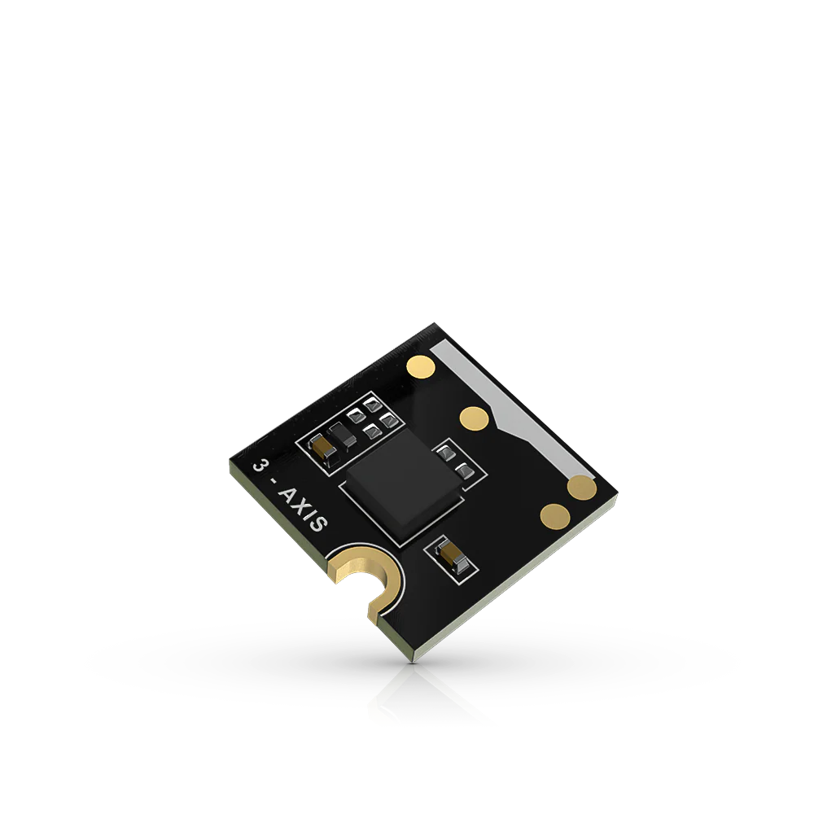

.. _rakwireless_rak1904:

RAK1904 WisBlock 3-Axis Acceleration Sensor Module
##################################################

Overview
********

RAK1904 is a WisBlock Sensor that extends the WisBlock system
with an ST LIS3DH 3-axis acceleration sensor. It has an
ultra-low-power high-performance three-axis linear accelerometer
with a digital I2C interface. The device features ultra-low-power
operational modes that allow advanced power saving and smart
embedded functions.

The accelerometer of the RAK1904 module can be dynamically
configured to work in the scales of ±2g/±4g/±8g/±16g and is
capable of measuring accelerations with output data rates
from 1 Hz to 5.3 kHz.

   RAK1904 WisBlock 3-Axis Acceleration Sensor Module (Credit: RAKwireless)

Product Features
****************

- Sensor specifications
   - User select able scales of ±2g/±4g/±8g/±16g
   - Data acquisition rates from 1 Hz to 5.3 kHz
   - Voltage Supply: 3.3 V
   - Current Consumption: 0.5 uA to 11 uA
   - Chipset: ST LIS3DH
- Size
   - 10 x 10 mm

More information about the shield can be found at
`RAK1904 WisBlock 3-Axis Acceleration Sensor Module`_.

Requirements
************

To use a RAK1904, you need at least a WisBlock Base
to plug the module in. WisBlock Base provides power
supply to the RAK1904 module. Furthermore, you need
a WisBlock Core module to use the sensor.

Mounting
********

.. figure:: img/mounting.webp
   :align: center
   :alt: RAK1904 WisBlock Sensor Mounting

   RAK1904 WisBlock Sensor Mounting (Credit: RAKwireless)

The mounting guide for RAK1904 can be found at `RAK1904 WisBlock Assembly Guide`_.

Pin Assignments
***************

WisBlock Sensor Slot A-C Pin Assignments

+-------------+----------+----------+----------+-----+-----+----------+----------+----------+-------------+
| Used        | C        | B        | A        | Pin | Pin | A        | B        | C        | Used        |
+-------------+----------+----------+----------+-----+-----+----------+----------+----------+-------------+
|             | NC       | NC       | TXD0     | 1   | 2   | GND      | GND      | GND      |             |
+-------------+----------+----------+----------+-----+-----+----------+----------+----------+-------------+
|             | SPI_CS   | SPI_CS   | SPI_CS   | 3   | 4   | SPI_CS   | SPI_CS   | SPI_CS   |             |
+-------------+----------+----------+----------+-----+-----+----------+----------+----------+-------------+
|             | SPI_MISO | SPI_MISO | SPI_MISO | 5   | 6   | SPI_MOSI | SPI_MOSI | SPI_MOSI |             |
+-------------+----------+----------+----------+-----+-----+----------+----------+----------+-------------+
| SCL         | I2C1_SCL | I2C1_SCL | I2C1_SCL | 7   | 8   | I2C1_SDA | I2C1_SDA | I2C1_SDA | SDA (0x18)  |
+-------------+----------+----------+----------+-----+-----+----------+----------+----------+-------------+
|             | VDD      | VDD      | VDD      | 9   | 10  | IO2      | IO1      | IO4      | INT2        |
+-------------+----------+----------+----------+-----+-----+----------+----------+----------+-------------+
|             | 3V3      | 3V3      | 3V3      | 11  | 12  | IO1      | IO2      | IO3      | INT1        |
+-------------+----------+----------+----------+-----+-----+----------+----------+----------+-------------+
|             | NC       | NC       | NC       | 13  | 14  | 3V3      | 3V3      | 3V3      |             |
+-------------+----------+----------+----------+-----+-----+----------+----------+----------+-------------+
|             | NC       | NC       | NC       | 15  | 16  | VDD      | VDD      | VDD      |             |
+-------------+----------+----------+----------+-----+-----+----------+----------+----------+-------------+
|             | NC       | NC       | NC       | 17  | 18  | NC       | NC       | NC       |             |
+-------------+----------+----------+----------+-----+-----+----------+----------+----------+-------------+
|             | NC       | NC       | NC       | 19  | 20  | NC       | NC       | NC       |             |
+-------------+----------+----------+----------+-----+-----+----------+----------+----------+-------------+
|             | NC       | NC       | NC       | 21  | 22  | NC       | NC       | NC       |             |
+-------------+----------+----------+----------+-----+-----+----------+----------+----------+-------------+
|             | GND      | GND      | GND      | 23  | 24  | RXD0     | NC       | NC       |             |
+-------------+----------+----------+----------+-----+-----+----------+----------+----------+-------------+

WisBlock Sensor Slot D-F Pin Assignments

+-------------+----------+----------+----------+-----+-----+----------+----------+----------+-------------+
| Used        | F        | E        | D        | Pin | Pin | D        | E        | F        | Used        |
+-------------+----------+----------+----------+-----+-----+----------+----------+----------+-------------+
|             | TXD1     | TXD0     | NC       | 1   | 2   | GND      | GND      | GND      |             |
+-------------+----------+----------+----------+-----+-----+----------+----------+----------+-------------+
|             | SPI_CS   | SPI_CS   | SPI_CS   | 3   | 4   | SPI_CS   | SPI_CS   | SPI_CS   |             |
+-------------+----------+----------+----------+-----+-----+----------+----------+----------+-------------+
|             | SPI_MISO | SPI_MISO | SPI_MISO | 5   | 6   | SPI_MOSI | SPI_MOSI | SPI_MOSI |             |
+-------------+----------+----------+----------+-----+-----+----------+----------+----------+-------------+
| SCL         | I2C1_SCL | I2C1_SCL | I2C1_SCL | 7   | 8   | I2C1_SDA | I2C1_SDA | I2C1_SDA | SDA (0x18)  |
+-------------+----------+----------+----------+-----+-----+----------+----------+----------+-------------+
|             | VDD      | VDD      | VDD      | 9   | 10  | IO6      | IO3      | IO5      | INT2        |
+-------------+----------+----------+----------+-----+-----+----------+----------+----------+-------------+
|             | 3V3      | 3V3      | 3V3      | 11  | 12  | IO5      | IO4      | IO6      | INT1        |
+-------------+----------+----------+----------+-----+-----+----------+----------+----------+-------------+
|             | NC       | NC       | NC       | 13  | 14  | 3V3      | 3V3      | 3V3      |             |
+-------------+----------+----------+----------+-----+-----+----------+----------+----------+-------------+
|             | NC       | NC       | NC       | 15  | 16  | VDD      | VDD      | VDD      |             |
+-------------+----------+----------+----------+-----+-----+----------+----------+----------+-------------+
|             | NC       | NC       | NC       | 17  | 18  | NC       | NC       | NC       |             |
+-------------+----------+----------+----------+-----+-----+----------+----------+----------+-------------+
|             | NC       | NC       | NC       | 19  | 20  | NC       | NC       | NC       |             |
+-------------+----------+----------+----------+-----+-----+----------+----------+----------+-------------+
|             | NC       | NC       | NC       | 21  | 22  | NC       | NC       | NC       |             |
+-------------+----------+----------+----------+-----+-----+----------+----------+----------+-------------+
|             | GND      | GND      | GND      | 23  | 24  | NC       | RXD0     | RXD1     |             |
+-------------+----------+----------+----------+-----+-----+----------+----------+----------+-------------+

Programming
***********

Set ``--shield rakwireless_rak1904_sensor_<a-f>`` when you invoke ``west build``,
for example:

.. zephyr-app-commands::
   :zephyr-app: samples/sensor/accel_trig
   :board: rak3312/esp32s3/procpu
   :shield: rakwireless_rak19007,rakwireless_rak1904_sensor_a
   :goals: build flash

References
**********

.. target-notes::

.. _RAK1904 WisBlock Assembly Guide:
   https://docs.rakwireless.com/product-categories/wisblock/rak1904/quickstart/#assembling-a-wisblock-module

.. _RAK1904 WisBlock 3-Axis Acceleration Sensor Module:
   https://docs.rakwireless.com/products/rak1904-lis3dh-3-axis-acceleration-sensor
