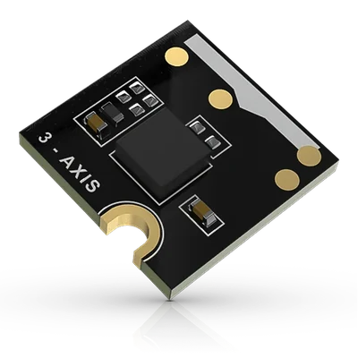

.. _rakwireless_rak1904:

RAK1904 WisBlock 3-Axis Acceleration Module
###########################################

Overview
********

RAK1904 is a WisBlock module carrying an ST LIS3DH 3-axis accelerometer. It mounts on a
WisBlock Sensor Slot and communicates over I2C at address 0x18. Both LIS3DH interrupt
outputs reach the Sensor Slot connector.

   RAK1904 WisBlock 3-Axis Acceleration Module (Credit: RAKwireless)

More information about the module can be found at `RAK1904 WisBlock 3-Axis Acceleration
Module`_.

Requirements
************

RAK1904 requires a WisBlock Base Board and a WisBlock Core module. The base board supplies
the Sensor Slot nodes this shield attaches to, so its shield must be listed first.

One shield is provided per Sensor Slot. Which slots exist depends on the base board.

.. list-table::
   :header-rows: 1

   * - Shield
     - Sensor Slot
   * - ``rakwireless_rak1904_sensor_a``
     - A
   * - ``rakwireless_rak1904_sensor_b``
     - B
   * - ``rakwireless_rak1904_sensor_c``
     - C
   * - ``rakwireless_rak1904_sensor_d``
     - D
   * - ``rakwireless_rak1904_sensor_e``
     - E
   * - ``rakwireless_rak1904_sensor_f``
     - F

Pin Assignments
***************

The LIS3DH interrupt outputs reach the base board through the Sensor Slot GPIO pins, which
resolve to a different WisBlock IO line on each slot.

+--------+-------------+-------+-------+-----+-----+-----+-----+
| Signal | Sensor Slot | A     | B     | C   | D   | E   | F   |
|        | pin         |       |       |     |     |     |     |
+========+=============+=======+=======+=====+=====+=====+=====+
| INT1   | 12 (GPIO2)  | IO1   | (IO2) | IO3 | IO5 | IO4 | IO6 |
+--------+-------------+-------+-------+-----+-----+-----+-----+
| INT2   | 10 (GPIO1)  | (IO2) | (IO1) | IO4 | IO6 | IO3 | IO5 |
+--------+-------------+-------+-------+-----+-----+-----+-----+

A parenthesized line is wired but is not put in ``irq-gpios``. WisBlock IO2 drives the
switched 3V3_S rail, so the shields do not claim it. ``irq-gpios`` lists INT1 first and
INT2 second, so dropping INT1 on Sensor Slot B drops INT2 with it and that slot is read
by polling.

Programming
***********

List the base board shield before this one so the Sensor Slot nodes exist:

.. zephyr-app-commands::
   :zephyr-app: samples/sensor/accel_trig
   :board: rak4631/nrf52840
   :shield: rakwireless_rak19007,rakwireless_rak1904_sensor_a
   :goals: build flash

References
**********

.. target-notes::

.. _RAK1904 WisBlock 3-Axis Acceleration Module:
   https://docs.rakwireless.com/product-categories/wisblock/rak1904
