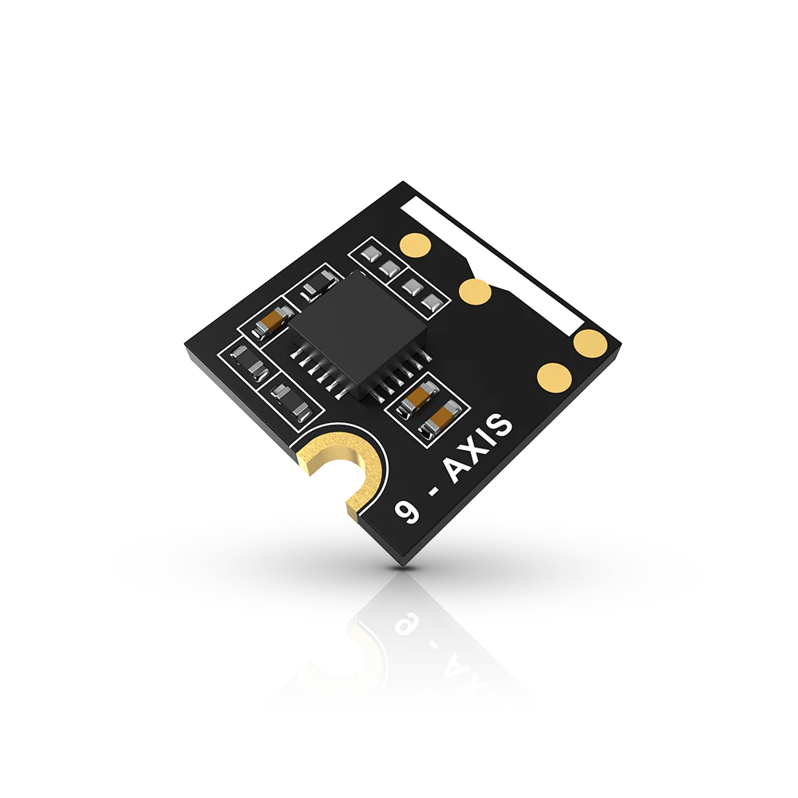
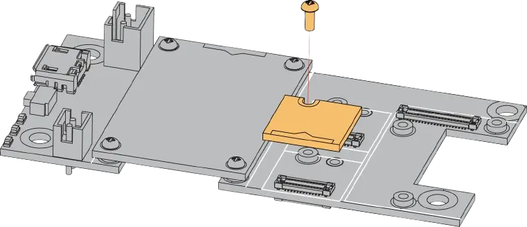

.. _rakwireless_rak1905:

RAK1905 WisBlock 9-Axis Sensor Module
#####################################

Overview
********

RAK1905 is a 3-axis gyroscope, 3-axis accelerometer,
and 3-axis magnetometer, part of the RAKwireless
WisBlock Sensor series. It is based on MPU-9250 from
TDK and designed for 9-axis motion tracking. The data
can be obtained via I2C interface.

   RAK1905 WisBlock 9-Axis Sensor Module (Credit: RAKwireless)

Product Features
****************

- Module Specifications
   - Chipset: TDK MPU-9250
   - Supply voltage: 3.3 V
   - Current consumption: 8 uA - 2.7 mA
   - Accelerometer output: ±2 g, ±4 g, ±8 g, and ±16 g
   - Gyroscope output: ±250, ±500, ±1000, and ±2000 °/sec
   - 16-bit ADCs
   - Magnetometer full-scale measurement range: ±4800 µT
   - Digital Motion Processor (DMP)
   - I2C Interface
- Size
   - 10 mm x 10 mm

More information about the shield can be found at
`RAK1905 WisBlock 9-Axis Sensor Module`_.

Requirements
************

To use a RAK1905, you need at least a WisBlock Base to
plug the module in. WisBlock Base is the power supply
for the RAK1905 module. Furthermore, you need a WisBlock
Core module to use the sensor.

Mounting
********

The figure shows the mounting mechanism of the RAK1905
module on a WisBlock Base board. The RAK1905 module can
be mounted on the slots: A, B, C, D, E, & F.

   RAK1905 WisBlock Sensor Mounting (Credit: RAKwireless)

The mounting guide for RAK1905 can be found at `RAK1905 WisBlock Assembly Guide`_.

Pin Assignments
***************

WisBlock Sensor Slot A-C Pin Assignments

+-------------+----------+----------+----------+-----+-----+----------+----------+----------+-------------+
| Used        | C        | B        | A        | Pin | Pin | A        | B        | C        | Used        |
+-------------+----------+----------+----------+-----+-----+----------+----------+----------+-------------+
|             | NC       | NC       | TXD0     | 1   | 2   | GND      | GND      | GND      |             |
+-------------+----------+----------+----------+-----+-----+----------+----------+----------+-------------+
|             | SPI_CS   | SPI_CS   | SPI_CS   | 3   | 4   | SPI_CS   | SPI_CS   | SPI_CS   |             |
+-------------+----------+----------+----------+-----+-----+----------+----------+----------+-------------+
|             | SPI_MISO | SPI_MISO | SPI_MISO | 5   | 6   | SPI_MOSI | SPI_MOSI | SPI_MOSI |             |
+-------------+----------+----------+----------+-----+-----+----------+----------+----------+-------------+
| SCL         | I2C1_SCL | I2C1_SCL | I2C1_SCL | 7   | 8   | I2C1_SDA | I2C1_SDA | I2C1_SDA | SDA (0x68)  |
+-------------+----------+----------+----------+-----+-----+----------+----------+----------+-------------+
|             | VDD      | VDD      | VDD      | 9   | 10  | IO2      | IO1      | IO4      |             |
+-------------+----------+----------+----------+-----+-----+----------+----------+----------+-------------+
|             | 3V3      | 3V3      | 3V3      | 11  | 12  | IO1      | IO2      | IO3      | INT         |
+-------------+----------+----------+----------+-----+-----+----------+----------+----------+-------------+
|             | NC       | NC       | NC       | 13  | 14  | 3V3      | 3V3      | 3V3      |             |
+-------------+----------+----------+----------+-----+-----+----------+----------+----------+-------------+
|             | NC       | NC       | NC       | 15  | 16  | VDD      | VDD      | VDD      |             |
+-------------+----------+----------+----------+-----+-----+----------+----------+----------+-------------+
|             | NC       | NC       | NC       | 17  | 18  | NC       | NC       | NC       |             |
+-------------+----------+----------+----------+-----+-----+----------+----------+----------+-------------+
|             | NC       | NC       | NC       | 19  | 20  | NC       | NC       | NC       |             |
+-------------+----------+----------+----------+-----+-----+----------+----------+----------+-------------+
|             | NC       | NC       | NC       | 21  | 22  | NC       | NC       | NC       |             |
+-------------+----------+----------+----------+-----+-----+----------+----------+----------+-------------+
|             | GND      | GND      | GND      | 23  | 24  | RXD0     | NC       | NC       |             |
+-------------+----------+----------+----------+-----+-----+----------+----------+----------+-------------+

WisBlock Sensor Slot D-F Pin Assignments

+-------------+----------+----------+----------+-----+-----+----------+----------+----------+-------------+
| Used        | F        | E        | D        | Pin | Pin | D        | E        | F        | Used        |
+-------------+----------+----------+----------+-----+-----+----------+----------+----------+-------------+
|             | TXD1     | TXD0     | NC       | 1   | 2   | GND      | GND      | GND      |             |
+-------------+----------+----------+----------+-----+-----+----------+----------+----------+-------------+
|             | SPI_CS   | SPI_CS   | SPI_CS   | 3   | 4   | SPI_CS   | SPI_CS   | SPI_CS   |             |
+-------------+----------+----------+----------+-----+-----+----------+----------+----------+-------------+
|             | SPI_MISO | SPI_MISO | SPI_MISO | 5   | 6   | SPI_MOSI | SPI_MOSI | SPI_MOSI |             |
+-------------+----------+----------+----------+-----+-----+----------+----------+----------+-------------+
| SCL         | I2C1_SCL | I2C1_SCL | I2C1_SCL | 7   | 8   | I2C1_SDA | I2C1_SDA | I2C1_SDA | SDA (0x68)  |
+-------------+----------+----------+----------+-----+-----+----------+----------+----------+-------------+
|             | VDD      | VDD      | VDD      | 9   | 10  | IO6      | IO3      | IO5      |             |
+-------------+----------+----------+----------+-----+-----+----------+----------+----------+-------------+
|             | 3V3      | 3V3      | 3V3      | 11  | 12  | IO5      | IO4      | IO6      | INT         |
+-------------+----------+----------+----------+-----+-----+----------+----------+----------+-------------+
|             | NC       | NC       | NC       | 13  | 14  | 3V3      | 3V3      | 3V3      |             |
+-------------+----------+----------+----------+-----+-----+----------+----------+----------+-------------+
|             | NC       | NC       | NC       | 15  | 16  | VDD      | VDD      | VDD      |             |
+-------------+----------+----------+----------+-----+-----+----------+----------+----------+-------------+
|             | NC       | NC       | NC       | 17  | 18  | NC       | NC       | NC       |             |
+-------------+----------+----------+----------+-----+-----+----------+----------+----------+-------------+
|             | NC       | NC       | NC       | 19  | 20  | NC       | NC       | NC       |             |
+-------------+----------+----------+----------+-----+-----+----------+----------+----------+-------------+
|             | NC       | NC       | NC       | 21  | 22  | NC       | NC       | NC       |             |
+-------------+----------+----------+----------+-----+-----+----------+----------+----------+-------------+
|             | GND      | GND      | GND      | 23  | 24  | NC       | RXD0     | RXD1     |             |
+-------------+----------+----------+----------+-----+-----+----------+----------+----------+-------------+

Programming
***********

Set ``--shield rakwireless_rak1905_sensor_<a-f>`` when you invoke ``west build``,
for example:

.. zephyr-app-commands::
   :zephyr-app: samples/sensor/sensor_shell
   :board: rak3312/esp32s3/procpu
   :shield: rakwireless_rak19007,rakwireless_rak1905_sensor_a
   :goals: build flash

References
**********

.. target-notes::

.. _RAK1905 WisBlock Assembly Guide:
   https://docs.rakwireless.com/product-categories/wisblock/rak1905/quickstart/#assembling-a-wisblock-module

.. _RAK1905 WisBlock 9-Axis Sensor Module:
   https://docs.rakwireless.com/product-categories/wisblock/rak1905/overview
