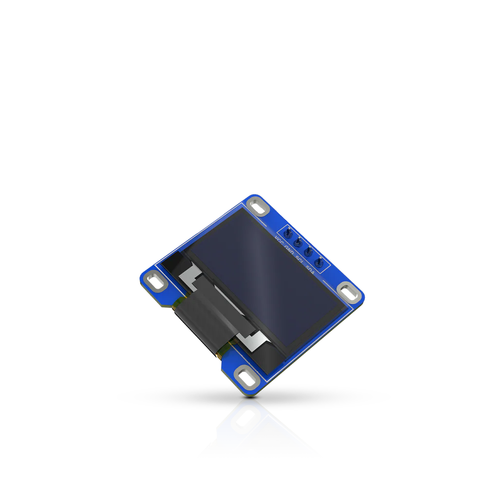
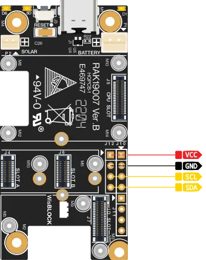
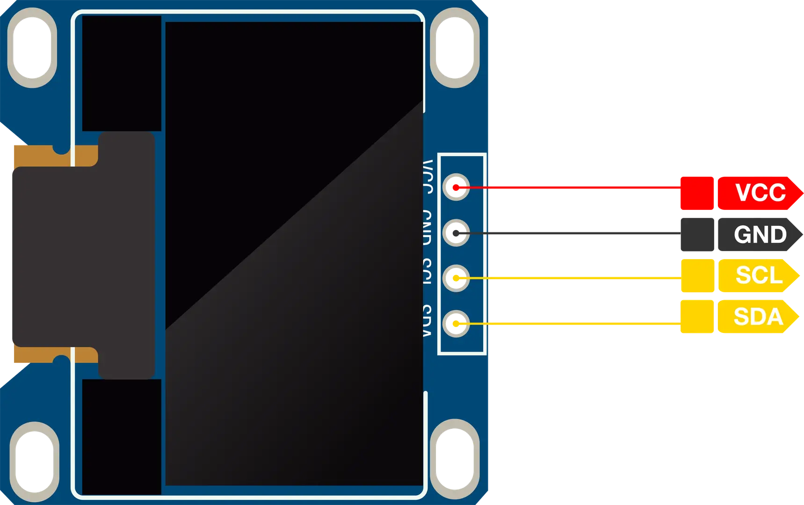

.. _rakwireless_rak1921:

RAK1921 WisBlock OLED Display
#############################

Overview
********

RAK1921 is a WisBlock Display module, which extends
the WisBlock system with an OLED display.

   RAK1921 WisBlock OLED Display (Credit: RAKwireless)

Product Features
****************

- Module specifications
   - 0.96 in OLED display
   - 128x64 pixel resolution
   - Bright white color on black background
   - I2C interface
   - Driver IC: SSD1306
   - Slim/thin Outline
   - Wide Viewing Angle
   - Wide Temperature Range
   - Low Power Consumption
   - Chipset: Solomon Systech Limited SSD1306
- Size
   - 27.8 x 27.3 mm

More information about the shield can be found at
`RAK1921 WisBlock OLED Display`_.

Requirements
************

To use a RAK1921, you need at least a WisBlock Base
to plug the module in. WisBlock Base is the power
supply for the RAK1921 module. Furthermore, you need
a WisBlock Core module to use the sensor.

RAK1921 does not occupy the WisBlock IO slot of
the WisBlock Base. Instead, it is plugged into a
separate connector. This connector is a standard
2.54 mm header and needs to be soldered to the
WisBlock Base board.

   I2C pin header in the RAK19007 (Credit: RAKwireless)

Pin Assignments
***************

The figure shows the name of the pins available in the RAK1921 module. This module supports an I2C interface.

   RAK1921 Pin Definition (Credit: RAKwireless)

Programming
***********

Set ``--shield rakwireless_rak1921`` when you invoke ``west build``,
for example:

.. zephyr-app-commands::
   :zephyr-app: samples/subsys/display/cfb
   :board: rak3312/esp32s3/procpu
   :shield: rakwireless_rak19007,rakwireless_rak1921
   :goals: build flash

References
**********

.. target-notes::

.. _RAK1921 WisBlock OLED Display:
   https://docs.rakwireless.com/product-categories/wisblock/rak1921/overview
