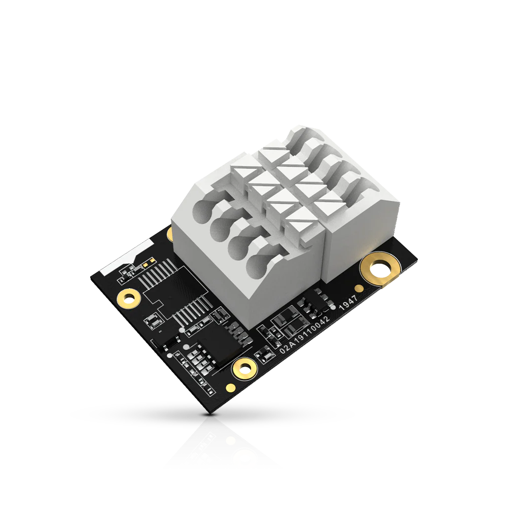

.. _rakwireless_rak5802:

RAK5802 WisBlock RS485 Interface Module
#######################################

Overview
********

RAK5802 is a WisBlock Interface module, which extends the WisBlock system
with an industry standard RS485 to serial converter. It supports one RS485
port and voltage supply for connected sensors.

The RAK5802 module features one RS485 interface. A protection circuity is
added against ESD hazard. It complies with the IEC61000-4-2 standard and
can protect up to 18 KV HBM ESD.

In addition, the RAK5802 supports one I2C interface to connect external sensors.

   RAK5802 WisBlock RS485 Interface Module (Credit: RAKwireless)

Product Features
****************

- Module specifications
   - RS485 to serial converter
   - Battery and 3.3 V output for sensors
   - 18 kV ESD protection
   - 1 port
   - Chipset: 3PEAK TP8485E
- Power consumption control
   - The RAK5802 modules power supply can be controlled by the WisBlock Core MCU to reduce power consumption.
- Size
   - 35 x 25 mm

More information about the shield can be found at
`RAK5802 WisBlock RS485 Interface Module`_.

Requirements
************

To use a RAK5802, you need at least a WisBlock Base to plug the module in.
WisBlock Base is the power supply for the RAK5802 module. Furthermore,
you need a WisBlock Core module to use the RAK5802.

Mounting
********

The RAK5802 module can be mounted on the IO slot of a WisBlock Base board.

The mounting guide for RAK5802 can be found at `RAK5802 WisBlock Assembly Guide`_.

Pin Assignments
***************

WisBlock IO Slot Pin Assignments

+-------------+----------+-----+-----+----------+-------------+
| Used        | A        | Pin | Pin | A        | Used        |
+-------------+----------+-----+-----+----------+-------------+
|             | VBAT     | 1   | 2   | VBAT     |             |
+-------------+----------+-----+-----+----------+-------------+
|             | GND      | 3   | 4   | GND      |             |
+-------------+----------+-----+-----+----------+-------------+
|             | 3V3      | 5   | 6   | 3V3      |             |
+-------------+----------+-----+-----+----------+-------------+
|             | USB_P    | 7   | 8   | USB_N    |             |
+-------------+----------+-----+-----+----------+-------------+
|             | VBUS     | 9   | 10  | SW1      |             |
+-------------+----------+-----+-----+----------+-------------+
|             | TXD0     | 11  | 12  | RXD0     |             |
+-------------+----------+-----+-----+----------+-------------+
|             | RESET    | 13  | 14  | LED1     |             |
+-------------+----------+-----+-----+----------+-------------+
|             | LED2     | 15  | 16  | LED3     |             |
+-------------+----------+-----+-----+----------+-------------+
|             | VDD      | 17  | 18  | VDD      |             |
+-------------+----------+-----+-----+----------+-------------+
| SDA         | I2C1_SDA | 19  | 20  | I2C1_SCL | SCL         |
+-------------+----------+-----+-----+----------+-------------+
|             | AIN0     | 21  | 22  | AIN1     |             |
+-------------+----------+-----+-----+----------+-------------+
|             | BOOT0    | 23  | 24  | IO7      |             |
+-------------+----------+-----+-----+----------+-------------+
|             | SPI_CS   | 25  | 26  | SPI_CLK  |             |
+-------------+----------+-----+-----+----------+-------------+
|             | SPI_MISO | 27  | 28  | SPI_MOSI |             |
+-------------+----------+-----+-----+----------+-------------+
| RS485_DE    | IO1      | 29  | 30  | IO2      |             |
+-------------+----------+-----+-----+----------+-------------+
|             | IO3      | 31  | 32  | IO4      |             |
+-------------+----------+-----+-----+----------+-------------+
| TXD         | TXD1     | 33  | 34  | RXD1     | RXD         |
+-------------+----------+-----+-----+----------+-------------+
|             | I2C2_SDA | 35  | 36  | I2C2_SCL |             |
+-------------+----------+-----+-----+----------+-------------+
|             | IO5      | 37  | 38  | IO6      |             |
+-------------+----------+-----+-----+----------+-------------+
|             | GND      | 39  | 40  | GND      |             |
+-------------+----------+-----+-----+----------+-------------+

Programming
***********

Set ``--shield rakwireless_rak5802`` when you invoke ``west build``,
for example:

.. zephyr-app-commands::
   :zephyr-app: samples/subsys/modbus/rtu_server
   :board: rak11310/rp2040
   :shield: rakwireless_rak19007,rakwireless_rak5802
   :goals: build flash

References
**********

.. target-notes::

.. _RAK5802 WisBlock Assembly Guide:
   https://docs.rakwireless.com/product-categories/wisblock/rak5802/quickstart/#assembling-a-wisblock-module

.. _RAK5802 WisBlock RS485 Interface Module:
   https://docs.rakwireless.com/product-categories/wisblock/rak5802/overview
