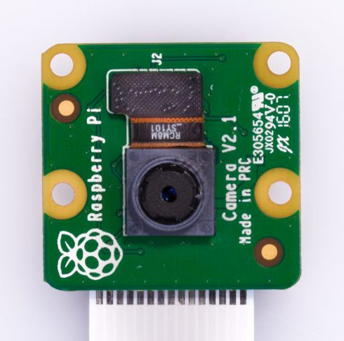
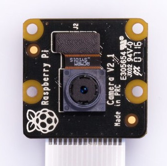

.. _raspberry_pi_camera_module_2:

Raspberry Pi Camera Module 2
############################

Overview
********

The Raspberry Pi camera module 2 provides a Sony IMX219 rolling shutter in a module featuring a
15-pin FFC connector popularized by Raspberry Pi, present on a wide range of boards.

The NoIR variant is the same as the normal variant, except with the infra-red filter removed.

   Raspberry Pi Camera Module 2, normal variant (Credit: Raspberry Pi.)

   Raspberry Pi Camera Module 2, NoIR variant (Credit: Raspberry Pi.)

Requirements
************

The camera module is compatible with all boards featuring a 15 pins FFC connector and the necessary
devicetree definitions for a :dtcompatible:`raspberrypi,csi-connector`.

Usage
*****

The shield can be used in any application by setting ``SHIELD`` to
``raspberry_pi_camera_module_2`` for boards with the necessary device tree node labels:

.. zephyr-app-commands::
   :zephyr-app: samples/drivers/video/capture
   :board: stm32n6570_dk
   :shield: raspberry_pi_camera_module_2
   :goals: build

References
**********

- `Product page <https://www.raspberrypi.com/products/camera-module-v2/>`_

- `Product page (NoIR) <https://www.raspberrypi.com/products/pi-noir-camera-v2/>`_

- `Datasheet <https://datasheets.raspberrypi.com/camera/camera-module-2-schematics.pdf>`_

- `Mechanical drawing <https://datasheets.raspberrypi.com/camera/camera-module-2-mechanical-drawing.pdf>`_
