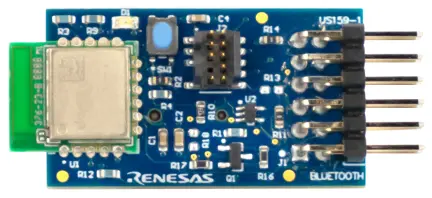
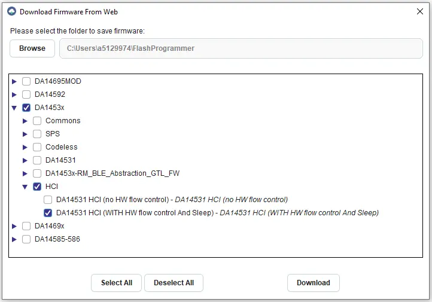

.. _renesas_us159_da14531evz_shield:

Renesas DA14531 Pmod Board
##########################

Overview
********

The Renesas US159 DA14531EVZ carries a `DA14531MOD`_ Bluetooth LE module
in a `Digilent Pmod`_ |trade| form factor.

   Renesas US159 DA14531EVZ Pmod (Credit: Renesas Electronics)

Requirements
************

This shield can only be used with a board that provides a Pmod |trade|
socket and defines the ``pmod_serial`` node label (see :ref:`shields` for
more details).

The DA14531 Module contained on the shield must be programmed with a binary
file that supports the HCI interface over UART, with hardware flow control
enabled.

The `Renesas SmartBond Flash Programmer`_ tool can be used to download a
suitable binary and then program it into the DA14531 via the SWD header
present on the Pmod board. Once the tool has been installed, open it and
press the "Search Online" button. The required binary file can be selected
for download as follows:

   Selecting the DA14531 HCI Binary File for Download

Press the "Program" button to program the binary file into the DA14531 Module.

For more information about interfacing to the DA14531 and the US159 DA14531EVZ
Pmod, see the following documentation:

- `DA14531MOD Datasheet`_
- `US159 DA14531EVZ Pmod`_

Programming
***********

Set ``--shield renesas_us159_da14531evz`` when you invoke ``west build``. For
example:

.. zephyr-app-commands::
   :zephyr-app: samples/bluetooth/beacon
   :board: ek_ra8m1
   :shield: renesas_us159_da14531evz
   :goals: build

References
**********

.. target-notes::

.. _DA14531MOD:
   https://www.renesas.com/us/en/products/wireless-connectivity/bluetooth-low-energy/da14531mod-smartbond-tiny-bluetooth-low-energy-module

.. _Digilent Pmod:
   https://digilent.com/reference/pmod/start

.. _Renesas SmartBond Flash Programmer:
   https://www.renesas.com/us/en/software-tool/smartbond-flash-programmer

.. _DA14531MOD Datasheet:
   https://www.renesas.com/us/en/document/dst/da14531-module-datasheet?r=1601921

.. _US159 DA14531EVZ Pmod:
   https://www.renesas.com/en/products/wireless-connectivity/bluetooth-low-energy/us159-da14531evz-low-power-bluetooth-pmod-board-renesas-quickconnect-iot
