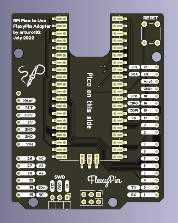

.. _rpi_pico_uno_flexypin:

Raspberry Pi Pico to UNO FlexyPin Adapter
#########################################

Overview
********

The Raspberry Pi Pico to Uno FlexyPin Adapter is an open-source hardware converter PCB that adapts
the Raspberry Pi Pico to the Arduino UNO form factor
This board is designed to be use with FlexyPin connector pins.
The FlexyPin holds Pico and contacts to castellated through-hole.

With simple soldering, it can also be used as a board to convert the Raspberry Pi Pico
to the Arduino UNO form factor.

Pins Assignment of the Raspberry Pi Pico to UNO FlexyPin Adapter
================================================================

+---------------------+------------+
| Rpi-Pico Pin        | UNO Header |
+=====================+============+
| GP0 (UART0 TX)      | D1         |
+---------------------+------------+
| GP1 (UART0 RX)      | D0         |
+---------------------+------------+
| GP2                 | D8         |
+---------------------+------------+
| GP3                 | D9         |
+---------------------+------------+
| GP4                 | D2         |
+---------------------+------------+
| GP5                 | D3         |
+---------------------+------------+
| GP6                 | D4         |
+---------------------+------------+
| GP7                 | D5         |
+---------------------+------------+
| GP8                 | D6         |
+---------------------+------------+
| GP9                 | D7         |
+---------------------+------------+
| GP13                | A3         |
+---------------------+------------+
| GP14 (I2C1 SDA)     | A4         |
+---------------------+------------+
| GP15 (I2C1 SCL)     | A5         |
+---------------------+------------+
| GP16 (SPI0 RX/CIPO) | D12        |
+---------------------+------------+
| GP17 (SPI0 CS)      | D10        |
+---------------------+------------+
| GP18 (SPI0 SCK)     | D13        |
+---------------------+------------+
| GP19 (SPI0 TX/COPI) | D11        |
+---------------------+------------+
| GP20                | D14        |
+---------------------+------------+
| GP21 (I2C0 SCL)     | D15        |
+---------------------+------------+
| GP26 (I2C0 SDA)     | A0         |
+---------------------+------------+
| GP27                | A1         |
+---------------------+------------+
| GP28                | A2         |
+---------------------+------------+

Programming
***********

Set ``--shield rpi_pico_uno_flexypin`` when you invoke ``west build``.
This shield is just a converter, so it is usually used with other Arduino shield.

For example,

.. zephyr-app-commands::
   :zephyr-app:  samples/net/wifi
   :board: rpi_pico
   :shield: rpi_pico_uno_flexypin,esp_8266_arduino
   :goals: build

References
**********

.. target-notes::

.. _FlexyPin:
   https://github.com/solderparty/flexypin

.. _FlexyPin Adapters:
   https://github.com/solderparty/flexypin_adapters_hw
