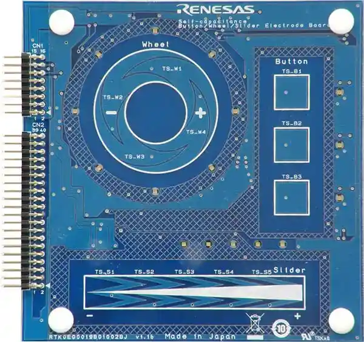

.. _rtk0eg0019b01002bj:

RTK0EG0019B01002BJ Capacitive Touch Application Shield
######################################################

Overview
********

The RTK0EG0019B01002BJ Capacitive Touch Application Shield is designed to work with the Renesas
Capacitive Touch Evaluation Kit.

The shield features a variety of touch sensors, including buttons, sliders, and wheels, making it
an ideal platform for developing touch-based applications.

   RTK0EG0019B01002BJ Capacitive Touch Application Shield (Credit: Renesas Electronics Corporation)

Pins Assignment of the RTK0EG0019B01002BJ Shield
================================================

Application Header 1 (CN1)
--------------------------

+---------+-------------+---------+-------------+
| CN1 Pin | Function    | CN1 Pin | Function    |
+=========+=============+=========+=============+
| 15      | VCC         | 16      | GND         |
+---------+-------------+---------+-------------+
| 13      | LED_ROW0    | 14      | LED_ROW1    |
+---------+-------------+---------+-------------+
| 11      | LED_ROW2    | 12      | LED_ROW3    |
+---------+-------------+---------+-------------+
| 9       | N/C         | 10      | N/C         |
+---------+-------------+---------+-------------+
| 7       | LED_COL3    | 8       | N/C         |
+---------+-------------+---------+-------------+
| 5       | LED_COL1    | 6       | LED_COL2    |
+---------+-------------+---------+-------------+
| 3       | N/C         | 4       | LED_COL0    |
+---------+-------------+---------+-------------+
| 1       | N/C         | 2       | N/C         |
+---------+-------------+---------+-------------+

Application Header 2 (CN2)
--------------------------

+---------+-------------------+---------+-------------------+
| CN2 Pin | Touch Electrode   | CN2 Pin | Touch Electrode   |
+=========+===================+=========+===================+
| 39      | N/C               | 40      | TSCAP             |
+---------+-------------------+---------+-------------------+
| 37      | N/C               | 38      | N/C               |
+---------+-------------------+---------+-------------------+
| 35      | N/C               | 36      | TS-W1             |
+---------+-------------------+---------+-------------------+
| 33      | N/C               | 34      | TS-W2             |
+---------+-------------------+---------+-------------------+
| 31      | TS-W3             | 32      | N/C               |
+---------+-------------------+---------+-------------------+
| 29      | N/C               | 30      | N/C               |
+---------+-------------------+---------+-------------------+
| 27      | N/C               | 28      | TS-W4             |
+---------+-------------------+---------+-------------------+
| 25      | N/C               | 26      | N/C               |
+---------+-------------------+---------+-------------------+
| 23      | N/C               | 24      | N/C               |
+---------+-------------------+---------+-------------------+
| 21      | N/C               | 22      | SHIELD-W1         |
+---------+-------------------+---------+-------------------+
| 19      | N/C               | 20      | N/C               |
+---------+-------------------+---------+-------------------+
| 17      | N/C               | 18      | N/C               |
+---------+-------------------+---------+-------------------+
| 15      | N/C               | 16      | N/C               |
+---------+-------------------+---------+-------------------+
| 13      | N/C               | 14      | N/C               |
+---------+-------------------+---------+-------------------+
| 11      | N/C               | 12      | N/C               |
+---------+-------------------+---------+-------------------+
| 9       | TS-B1             | 10      | TS-B2             |
+---------+-------------------+---------+-------------------+
| 7       | SHIELD-B1         | 8       | TS-B3             |
+---------+-------------------+---------+-------------------+
| 5       | TS-S1             | 6       | SHIELD-S1         |
+---------+-------------------+---------+-------------------+
| 3       | TS-S3             | 4       | TS-S2             |
+---------+-------------------+---------+-------------------+
| 1       | TS-S5             | 2       | TS-S4             |
+---------+-------------------+---------+-------------------+

Programming
***********

Set ``--shield rtk0eg0019b01002bj`` when you invoke ``west build``. For example:

.. zephyr-app-commands::
   :zephyr-app: samples/shields/rtk0eg0019b01002bj
   :board: rssk_ra2l1
   :shield: rtk0eg0019b01002bj
   :goals: build

References
**********
- `Capacitive Touch Evaluation System for RA2L1`_

.. _Capacitive Touch Evaluation System for RA2L1:
   https://www.renesas.com/en/products/microcontrollers-microprocessors/ra-cortex-m-mcus/rtk0eg0022s01001bj-capacitive-touch-evaluation-system-ra2l1
