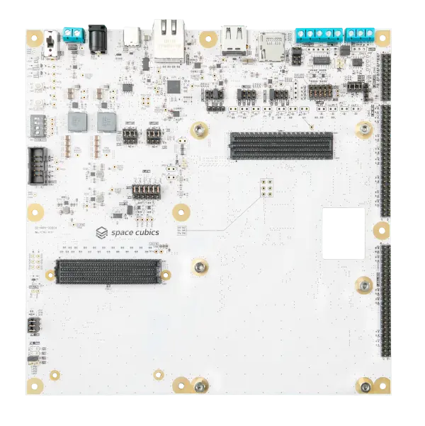

.. _sc_scobc_v1_dev_board:

SC-OBC Module V1 Development Board
##################################

Overview
********

The development board for the :zephyr:board:`scobc_v1` connects to the module
via its board-to-board connector and provides a Gigabit Ethernet port (GEM1
with a TI DP83867 PHY).

Since the board's interfaces can be accessed by both the APU (Linux) and the
RPU (Zephyr), this shield describes all interfaces but leaves them disabled by
default, to prevent both from accessing them at the same time. To use an
interface from Zephyr, enable it in an application overlay
(``status = "okay"``). Make sure it is also accessible to the RPU subsystem in
the hardware design and disabled in the Linux device tree.

Programming
***********

Set ``--shield sc_scobc_v1_dev_board`` when you invoke ``west build``. For example:

.. zephyr-app-commands::
   :zephyr-app: samples/net/sockets/echo
   :board: scobc_v1/versal_rpu
   :shield: sc_scobc_v1_dev_board
   :goals: build
