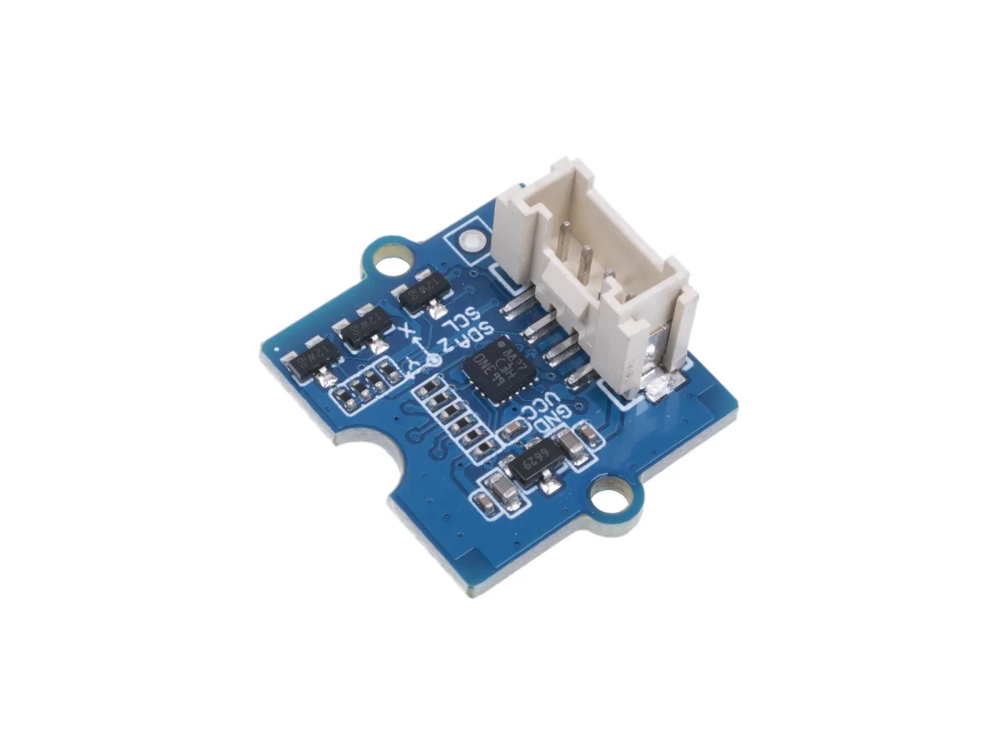

.. _seeed_grove_3axis_digital_accelerometer:

Seeed Studio Grove 3-Axis Digital Accelerometer
###############################################

Overview
********

The Seeed Studio Grove 3-Axis Digital Accelerometer is a compact sensor module
that provides digital output of 3-axis acceleration.
There are several variations by the measurement range and chip.

     Grove - 3-Axis Digital Accelerometer (LIS3DHTR) (Credit: Seeed Studio)

These allows for easy integration with Grove connector system.
More information about the Grove connector system can be found at the
`Grove Ecosystem Introduction`_.

Hardware
********

Currently the following models are supported:

- seeed_grove_lis3dhtr: see `Grove - 3-Axis Digital Accelerometer (LIS3DHTR)`_

Programming
***********

Set ``--shield seeed_grove_accel_[sensor_model]`` when you invoke ``west build``.
For example:

.. zephyr-app-commands::
   :zephyr-app: samples/sensor/sensor_shell
   :board:  m5stack_core2/esp32/procpu
   :shield: seeed_grove_accel_lis3dhtr
   :goals: build

This shield can take a option to tweaking.
Such as connecting bus selection, i2c address, and etc.

.. zephyr-app-commands::
   :zephyr-app: samples/sensor/sensor_shell
   :board: wio_terminal/samd51p19a
   :shield: seeed_grove_accel_lis3dhtr@1:addr=0x18
   :goals: build

References
**********

.. target-notes::

.. _Grove Ecosystem Introduction:
   https://wiki.seeedstudio.com/Grove_System/

.. _Grove - 3-Axis Digital Accelerometer (LIS3DHTR):
   https://wiki.seeedstudio.com/Grove-3-Axis-Digital-Accelerometer-LIS3DHTR/
