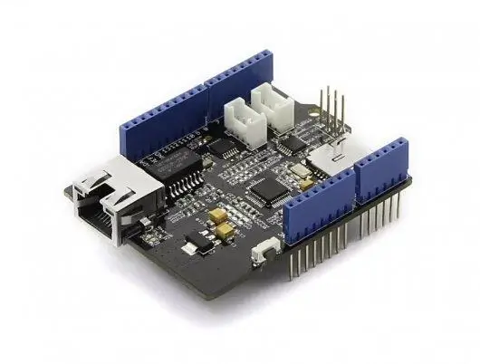

.. _seeed_w5500:

Seeed W5500 Ethernet Shield
###########################

Overview
********

Seeed `W5500 Ethernet Shield`_ is an Arduino connector shield with:

- `W5500`_ 10/100 MBPS stand alone Ethernet controller with on-board MAC & PHY
  and 16 KiloBytes for FIFO buffer,
- SPI serial interface,
- Grove UART connector,
- Grove I2C connector,
- SD card slot.

   Seeed W5500 Ethernet Shield

Pins Assignment of the W5500 Shield
===================================

+-----------------------+---------------------------------------------+
| Shield Connector Pin  | Function                                    |
+=======================+=============================================+
| RST                   | Ethernet Controller's Reset                 |
+-----------------------+---------------------------------------------+
| D2                    | Ethernet Controller's Interrupt Output      |
+-----------------------+---------------------------------------------+
| D10                   | SPI's Chip Select                           |
+-----------------------+---------------------------------------------+
| D11                   | SPI's Master Output Slave Input (MOSI)      |
+-----------------------+---------------------------------------------+
| D12                   | SPI's Master Input Slave Output (MISO)      |
+-----------------------+---------------------------------------------+
| D13                   | SPI's Clock                                 |
+-----------------------+---------------------------------------------+

Requirements
************

This shield can only be used with a board that provides a configuration
for Arduino connectors and defines node aliases for SPI and GPIO interfaces
(see :ref:`shields` for more details).

Programming
***********

Set ``--shield seeed_w5500`` when you invoke ``west build``. For example:

.. zephyr-app-commands::
   :zephyr-app: samples/net/dhcpv4_client
   :board: nrf52840dk/nrf52840
   :shield: seeed_w5500
   :goals: build

References
**********

.. target-notes::

.. _W5500:
   https://wiznet.io/products/iethernet-chips/w5500

.. _W5500 Ethernet Shield:
   https://wiki.seeedstudio.com/W5500_Ethernet_Shield_v1.0
