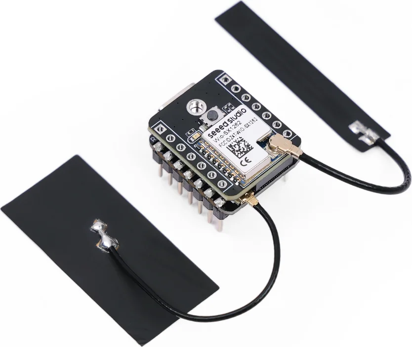

.. Copyright (c) 2026 Marcin Niestroj
.. SPDX-License-Identifier: Apache-2.0

.. _seeed_wio_sx1262_esp32s3:

Wio-SX1262 for XIAO ESP32S3
###########################

Overview
********

The Wio-SX1262 for XIAO ESP32S3 is a compact LoRa expansion board based on the
Semtech SX1262 transceiver. It connects to the XIAO ESP32S3 through the board-to-board
connector used by the XIAO ESP32S3 and Wio-SX1262 kit.

   Wio-SX1262 for XIAO ESP32S3 (Credit: Seeed Studio)

More information is available in the `Wio-SX1262 kit documentation`_ and the
`Wio-SX1262 module datasheet`_.

This shield definition supports only the ESP32-S3 B2B carrier. The Wio-SX1262 carrier
which connects through the standard XIAO pin headers has different control signals and
is not compatible with this overlay.

Hardware
********

The SX1262 is connected to the XIAO ESP32S3 as follows:

.. list-table:: Pin assignment
   :header-rows: 1

   * - Function
     - ESP32-S3 GPIO
   * - SPI SCK
     - GPIO7
   * - SPI MISO
     - GPIO8
   * - SPI MOSI
     - GPIO9
   * - SX1262 NSS
     - GPIO41
   * - SX1262 RESET
     - GPIO42
   * - SX1262 BUSY
     - GPIO40
   * - SX1262 DIO1
     - GPIO39
   * - RF switch receive enable
     - GPIO38
   * - User button
     - GPIO21
   * - Green user LED
     - GPIO48

The SX1262 DIO2 signal selects transmit while GPIO38 selects receive. DIO3 supplies
the TCXO at 1.8 V, and the radio uses its internal DC-DC regulator.

.. warning::

   Connect a suitable 862-930 MHz antenna to the LoRa antenna connector before
   transmitting. Operating the SX1262 without an antenna can damage its RF output.

Programming
***********

Set ``--shield seeed_wio_sx1262_esp32s3`` and select the native LoRa backend when
building for the XIAO ESP32S3. For example:

.. zephyr-app-commands::
   :zephyr-app: samples/drivers/lora/send
   :board: xiao_esp32s3/esp32s3/procpu
   :shield: seeed_wio_sx1262_esp32s3
   :gen-args: -DCONFIG_LORA_MODULE_BACKEND_NATIVE=y
   :goals: build

References
**********

.. target-notes::

.. _Wio-SX1262 kit documentation:
   https://wiki.seeedstudio.com/wio_sx1262_with_xiao_esp32s3_kit/
.. _Wio-SX1262 module datasheet:
   https://files.seeedstudio.com/products/SenseCAP/Wio_SX1262/Wio-SX1262_Module_Datasheet.pdf
