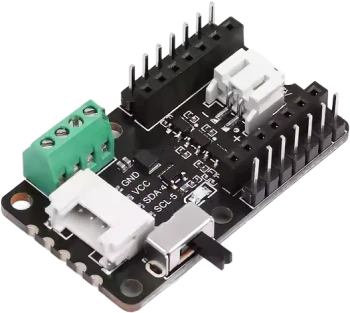

.. _seeed_xiao_cob_led:

Seeed Studio COB LED Driver Board for XIAO
##########################################

Overview
********

The `Seeed Studio COB LED Driver Board for XIAO`_ is a seven-channel lighting carrier for the Seeed
Studio XIAO family. It exposes two high-power switched outputs on D0 and D1 plus four active-low PWM
outputs on D2, D3, D8, and D9 for dimming effects.

In Zephyr, the shield provides two always-available GPIO-switched outputs on D0 and D1 and four
optional PWM outputs on D2, D3, D8, and D9. The base shield overlay always exposes the D0 and D1
outputs as ``led0`` and ``led1``. The PWM outputs are described by the shield, but they remain
disabled until a board-specific or application overlay routes them to PWM hardware on the attached
XIAO board.

   Seeed Studio COB LED Driver Board for XIAO (Credit: Seeed Studio)

Pin Assignments
===============

+----------------------+----------------------+----------------------------------------------+
| XIAO pin             | Zephyr alias         | Function                                     |
+======================+======================+==============================================+
| D0                   | ``led0``             | High-power switched output 0                 |
+----------------------+----------------------+----------------------------------------------+
| D1                   | ``led1``             | High-power switched output 1                 |
+----------------------+----------------------+----------------------------------------------+
| D2                   | ``pwm-led0``         | Low-power PWM output 0, active low           |
+----------------------+----------------------+----------------------------------------------+
| D3                   | ``pwm-led1``         | Low-power PWM output 1, active low           |
+----------------------+----------------------+----------------------------------------------+
| D8                   | ``pwm-led2``         | Low-power PWM output 2, active low           |
+----------------------+----------------------+----------------------------------------------+
| D9                   | ``pwm-led3``         | Low-power PWM output 3, active low           |
+----------------------+----------------------+----------------------------------------------+
| SDA / SCL            | N/A                  | Grove I2C connector                          |
+----------------------+----------------------+----------------------------------------------+

Requirements
************

This shield can be used with boards that expose the XIAO connector label (``xiao_d``).

The shield definition always provides GPIO LED aliases for the two high-power outputs on D0 and D1.

The four low-power outputs on D2, D3, D8, and D9 require PWM routing that depends on the attached
XIAO board. The shield defines ``pwm-led0`` through ``pwm-led3`` aliases for those outputs, but the
corresponding nodes stay disabled until a board-specific or application overlay provides PWM
controller, channel, and pinctrl configuration. The following section describes how this
configuration can be done.

PWM Configuration
=================

Enabling PWM on specific pins requires PWM peripheral configuration that is specific to the board.
Therefore, an overlay similar to
:zephyr_file:`boards/shields/seeed_xiao_cob_led/boards/xiao_esp32c6_esp32c6_hpcore.overlay`
must be supplied for your XIAO board (either alongside this shield as a board overlay or from your
application). It should:

* enable a PWM controller with 4 channels and the appropriate pin control configuration to assign
  them to the pins D2, D3, D8, and D9 of the shield,
* add ``pwms`` properties to the shield's ``pwm-led0`` through ``pwm-led3`` nodes.

The low-power outputs on this shield use active-low logic, so set ``PWM_POLARITY_INVERTED`` on each
``pwms`` entry.

Programming
***********

Set ``--shield seeed_xiao_cob_led`` when invoking ``west build``.

For example, to use the high-power D0 output with :zephyr:code-sample:`blinky`:

.. zephyr-app-commands::
   :zephyr-app: samples/basic/blinky
   :board: xiao_esp32c6/esp32c6/hpcore
   :shield: seeed_xiao_cob_led
   :goals: build

As a reminder, to use the PWM outputs, you need to provide PWM routing configuration in a Devicetree
overlay. The included ``xiao_esp32c6/esp32c6/hpcore`` shield overlay allows to build the
:zephyr:code-sample:`pwm-blinky` sample as follows:

.. zephyr-app-commands::
   :zephyr-app: samples/basic/blinky_pwm
   :board: xiao_esp32c6/esp32c6/hpcore
   :shield: seeed_xiao_cob_led
   :goals: build

References
**********

.. target-notes::

.. _Seeed Studio COB LED Driver Board for XIAO:
   https://wiki.seeedstudio.com/getting_started_with_cob_led_dirver_board/
