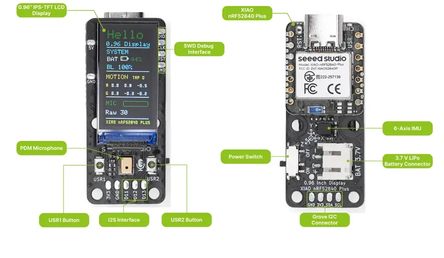
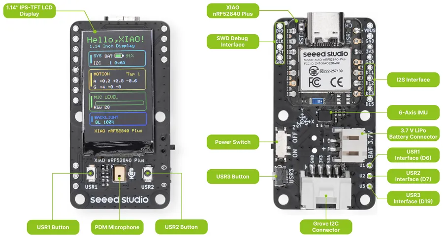
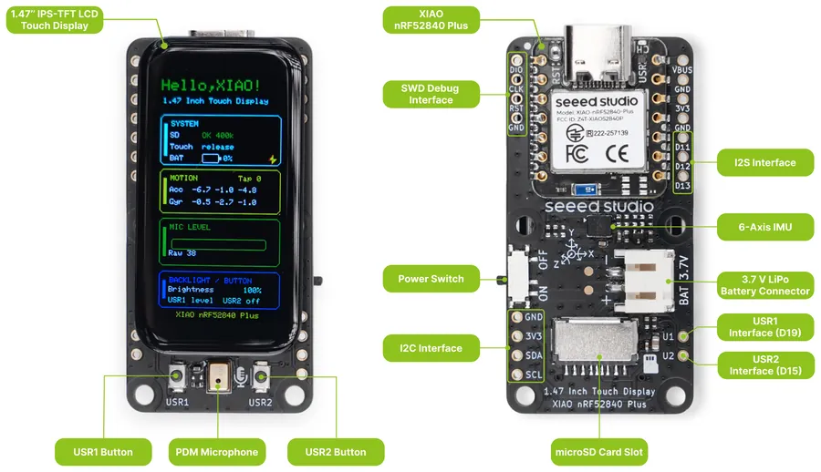

.. _seeed_xiao_display_gadgets:

Seeed Studio XIAO Display Gadgets
#################################

Overview
********

The Seeed Studio XIAO display gadgets are small carrier boards built around a XIAO Plus module,
which is soldered on the board using the additional pads of the XIAO Plus form factor. They combine
an IPS LCD with a PDM microphone, an LSM6DS3TR-C 6-axis IMU, user buttons and a LiPo battery
connector with a power switch.

Three boards are available, each in a version powered by the XIAO nRF52840 Plus and a version
powered by the XIAO ESP32S3 Plus. Both versions of a board connect the display, the buttons and
the sensors to the same XIAO pin names, so the same shield describes both.

.. list-table::
   :header-rows: 1

   * - Shield
     - Display
     - Additional features
   * - ``seeed_xiao_display_0_96``
     - 0.96" 80x160 IPS LCD (ST7735)
     -
   * - ``seeed_xiao_display_1_14``
     - 1.14" 135x240 IPS LCD (ST7789)
     - Grove I2C connector, third user button
   * - ``seeed_xiao_display_1_47``
     - 1.47" 172x320 IPS LCD (JD9853A)
     - AXS5106L capacitive touch controller, microSD card slot

More information can be found on the `XIAO Display Gadgets wiki`_.

   XIAO 0.96" IPS Display (Credit: Seeed Studio)

   XIAO 1.14" IPS Display (Credit: Seeed Studio)

   XIAO 1.47" IPS Touch Display (Credit: Seeed Studio)

Pin Assignments
***************

.. list-table::
   :header-rows: 1

   * - XIAO pin
     - 0.96" display
     - 1.14" display
     - 1.47" display
   * - D0
     - Microphone clock
     - Microphone clock
     - Microphone clock
   * - D1
     - Microphone data
     - Microphone data
     - Microphone data
   * - D2
     - LCD SPI CS
     - LCD SPI CS
     - LCD SPI CS
   * - D3
     - LCD data/command
     - LCD data/command
     - LCD data/command
   * - D4, D5
     - I2C SDA, SCL
     - I2C SDA, SCL
     - I2C SDA, SCL
   * - D6
     - USR1 button
     - USR1 button
     - microSD SPI CS
   * - D7
     - USR2 button
     - USR2 button
     - Touch interrupt
   * - D8, D10
     - LCD SPI SCK, MOSI
     - LCD SPI SCK, MOSI
     - LCD and microSD SPI SCK, MOSI
   * - D9
     -
     -
     - microSD SPI MISO
   * - D14
     - IMU interrupt
     - IMU interrupt
     - IMU interrupt
   * - D15
     -
     -
     - USR2 button
   * - D17
     - LCD reset
     - LCD reset
     - LCD and touch reset
   * - D18
     - LCD backlight
     - LCD backlight
     - LCD backlight
   * - D19
     -
     - USR3 button
     - USR1 button

The buttons are available through the ``sw0`` to ``sw2`` aliases, in the order of their USR
number, and report ``INPUT_KEY_0`` to ``INPUT_KEY_2``. The IMU is available through the
``accel0`` alias. The backlight is controlled by a fixed regulator enabled at boot.

The touch controller of the 1.47" display is the ``zephyr,touch`` chosen node. It shares its reset
line with the LCD controller, and this line has no pull-up resistor. Only the display driver drives
the line, so applications that use the touch controller must also enable the display driver with
:kconfig:option:`CONFIG_DISPLAY`.

The XIAO serial interface (``xiao_serial``) is disabled, as D6 and D7 are used by the boards.

Requirements
************

These shields can be used with a board that provides the XIAO Plus connector, see
:dtcompatible:`seeed,xiao-plus-gpio`. The boards are sold with the module soldered, so use the
board target that matches the module:

- :zephyr:board:`xiao_nrf52840_plus` for the nRF52840 versions.

On the XIAO nRF52840 Plus, the shields also enable the PDM microphone, available through the
``dmic0`` alias, and set ``nfct-pins-as-gpios`` in the ``uicr`` node, as D14 and D15 are the NFC
pins of the nRF52840. This UICR setting is kept until the UICR is erased.

Programming
***********

Set ``--shield`` to the shield matching the display when you invoke ``west build``. For example,
to build the :zephyr:code-sample:`lvgl` sample:

.. tabs::

   .. group-tab:: 0.96" display

      .. zephyr-app-commands::
         :zephyr-app: samples/subsys/display/lvgl
         :board: xiao_nrf52840_plus
         :shield: seeed_xiao_display_0_96
         :goals: build flash

   .. group-tab:: 1.14" display

      .. zephyr-app-commands::
         :zephyr-app: samples/subsys/display/lvgl
         :board: xiao_nrf52840_plus
         :shield: seeed_xiao_display_1_14
         :goals: build flash

   .. group-tab:: 1.47" touch display

      .. zephyr-app-commands::
         :zephyr-app: samples/subsys/display/lvgl
         :board: xiao_nrf52840_plus
         :shield: seeed_xiao_display_1_47
         :goals: build flash

References
**********

.. target-notes::

.. _XIAO Display Gadgets wiki:
   https://wiki.seeedstudio.com/display_gadgets/
