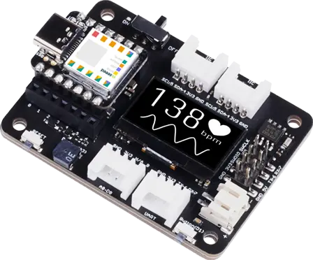

.. _seeed_xiao_expansion_board:

Seeed Studio XIAO Expansion Board
#################################

Overview
********

Seeed Studio XIAO Expansion Board is a powerful functional expansion board
for `Seeed Studio XIAO series`_ of only half Raspberry Pi 4 size. It enables
building prototypes and projects in an easy and quick way. With its rich
peripherals, you could explore the infinite possibilities of Seeed Studio
XIAO series.

     Seeed Studio XIAO Expansion Board (Credit: Seeed Studio)

Pin Assignments
===============

+-----------------------+---------------------------------------------+
| Shield Connector Pin  | Function                                    |
+=======================+=============================================+
| 0                     | Grove*1 (A0, D0)                            |
+-----------------------+---------------------------------------------+
| 1                     | User button                                 |
+-----------------------+---------------------------------------------+
| 2                     | MicroSD SPI CSn                             |
+-----------------------+---------------------------------------------+
| 3                     | Buzzer(A3)                                  |
+-----------------------+---------------------------------------------+
| 4                     | Grove*2 I2C SDA                             |
+-----------------------+---------------------------------------------+
| 5                     | Grove*2 I2C SCL                             |
+-----------------------+---------------------------------------------+
| 6                     | Grove*1 UART TX                             |
+-----------------------+---------------------------------------------+
| 7                     | Grove*1 UART RX                             |
+-----------------------+---------------------------------------------+
| 8                     | MicroSD SPI SCK      (Serial Clock Input)   |
+-----------------------+---------------------------------------------+
| 9                     | MicroSD SPI MISO     (Serial Data Input)    |
+-----------------------+---------------------------------------------+
| 10                    | MicroSD SPI MOSI     (Serial Data Output)   |
+-----------------------+---------------------------------------------+

Programming
***********

LED Button Sample
=================

Set ``--shield seeed_xiao_expansion_board`` when you invoke ``west build``. For example:

.. zephyr-app-commands::
   :zephyr-app: samples/basic/button
   :board: xiao_ble/nrf52840
   :shield: seeed_xiao_expansion_board
   :goals: build

LVGL Basic Sample
==========================

Set ``--shield seeed_xiao_expansion_board`` when you invoke ``west build``. For example:

.. zephyr-app-commands::
   :zephyr-app: samples/subsys/display/lvgl
   :board: xiao_ble/nrf52840
   :shield: seeed_xiao_expansion_board
   :goals: build

.. _Seeed Studio XIAO series:
   https://www.seeedstudio.com/XIAO-c-1964.html
