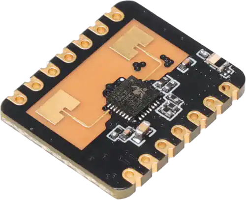

.. _seeed_xiao_hsp24:

Seeed Studio 24GHz mmWave Sensor for XIAO
#########################################

Overview
********

The `Seeed Studio 24GHz mmWave Sensor for XIAO`_ is a UART radar module for human presence and distance
reporting.

   Seeed Studio 24GHz mmWave Sensor for XIAO (Credit: Seeed Studio)

Requirements
************

This shield can be used with boards that expose the XIAO connector labels and define a
``xiao_serial`` node label. The module's UART RX/TX pins are connected to pins D2/D3 of the XIAO
connector, so you will likely need to override the default pinmux settings for your board when
using this shield.

The radar module and board UART baud rates must match. The default factory settings for the module
is 256000 baud, so this shield configures ``xiao_serial`` to 256000 by default.

Programming
***********

Set ``--shield seeed_xiao_hsp24`` when invoking ``west build``.

For example, using the :zephyr:code-sample:`s3km1110` sample:

.. zephyr-app-commands::
   :zephyr-app: samples/sensor/s3km1110
   :board: xiao_esp32c6/esp32c6/hpcore
   :shield: seeed_xiao_hsp24
   :goals: build

.. _Seeed Studio 24GHz mmWave Sensor for XIAO:
   https://wiki.seeedstudio.com/mmwave_for_xiao/
