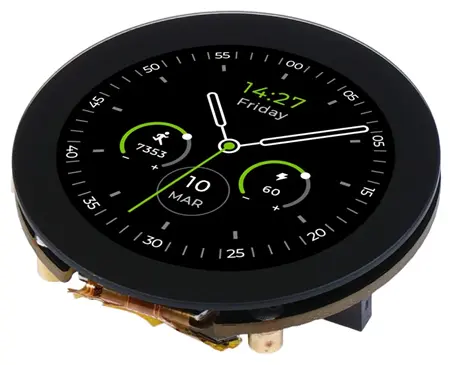

.. _seeed_xiao_round_display:

Seeed Studio XIAO Round Display
###############################

Overview
********

Seeed Studio Round Display for XIAO is an expansion board compatible with all
XIAO development boards. It features a fully covered touch screen on one side,
designed as a 39mm disc. It contains onboard RTC, charge chip, TF card slot
within its compact size, perfect for interactive displays in smart home,
wearables and more.

More information can be found on `the Getting Started page`_

     Seeed Studio XIAO Round Display (Credit: Seeed Studio)

Programming
***********

Set ``-DSHIELD=seeed_xiao_round_display`` when you invoke ``west build``.

LVGL Basic Sample
=================

For example:

.. zephyr-app-commands::
   :zephyr-app: samples/subsys/display/lvgl
   :board: xiao_ble/nrf52840
   :shield: seeed_xiao_round_display
   :goals: build

.. _the Getting Started page:
   https://wiki.seeedstudio.com/get_start_round_display/
