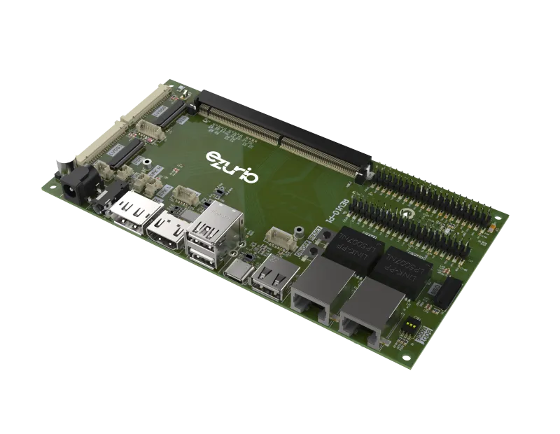

.. _smarc_car_brd:

Ezurio Universal SMARC Carrier Board
#####################################

Overview
********

The Ezurio Universal SMARC Carrier Board is a SMARC 2.x carrier board used to evaluate
Ezurio SMARC System on Modules (SOMs), such as the Nitrogen93 SMARC
(``nitrogen93_smarc``).

   Ezurio Universal SMARC Carrier Board

The carrier board exposes the SOM's SMARC connector signals as:

- 2x CAN (with on-board CAN transceivers)
- Ethernet (2x link-speed LEDs)
- GPIO
- I2C, routed through an on-board TCA9546A I2C mux to four downstream
  channels (RTC, USB-C, audio codec, PCIe)
- SPI
- UART
- SDIO (microSD card slot)
- USB
- I2S, connected to an on-board Wolfson/Cirrus WM8962 audio codec

Requirements
************

This shield can only be used with a SOM board that provides the
``smarc_gpio``, ``smarc_gbe_led``, ``smarc_can0`` / ``smarc_can1``,
``smarc_ser2``, ``smarc_i2c_gp``, ``smarc_spi0``, ``smarc_sdio``,
``smarc_usb0``, and ``smarc_i2s0`` devicetree node labels, following the
SMARC 2.x connector naming convention used by ``nitrogen93_smarc``.

The WM8962 master clock is SoC specific, so audio also requires a
``boards/<board>.overlay`` in this shield's directory that sets the
``clocks`` property of the ``audio_codec`` node, as done for
``nitrogen93_smarc``.

Usage
*****

The shield can be used in any application by setting ``--shield
smarc_car_brd`` when invoking ``west build``, for example:

.. zephyr-app-commands::
   :zephyr-app: samples/hello_world
   :host-os: unix
   :board: nitrogen93_smarc/mimx9352/a55
   :shield: smarc_car_brd
   :goals: build
