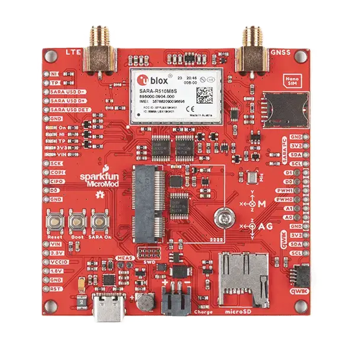

.. _sparkfun_carrier_asset_tracker:

Sparkfun SparkFun MicroMod Asset Tracker Shield
###############################################

Overview
********

The SparkFun MicroMod Asset Tracker Carrier Shield is part of the Sparkfun
Micromod standard, a modular interface ecosystem that uses the M.2 standard
to mix and match your choice of processor with specific Functions Boards.

The Asset Tracker Carrier Shield is built around the u-blox SARA-R510M8S
module, which offers Secure Cloud LTE-M and NB-IoT data communication for
multi-regional use and GNSS capabilities via an integrated u-blox M8 GNSS
receiver for accurate positioning information.

Besides, this shield has an integrated ICM-20948 Inertial Measurement Unit
(IMU) for Nine Degree-Of-Freedom, a built-in micro-SD card socket for data
logging as well as a nano SIM card port.

   Sparkfun SparkFun MicroMod Asset Tracker Shield (Credit: Sparkfun)

More information about the shield can be found at the `SparkFun MicroMod
Asset Tracker guide website`_.

Pins Assignment of Sparkfun SparkFun MicroMod Asset Tracker Shield
==================================================================

The SparkFun MicroMod Asset Tracker Carrier Shield uses a 76 pins M.2
connector. The following table depicts the interfaces and pins supported:
by Zephyr:
+-----------------------+---------------------------------+
| Shield Connector Pin  | Function                        |
+=======================+=================================+
| micromod_1_uart alias | UART 1 (with CTS and RTS pins)  |
+-----------------------+---------------------------------+
| micromod_2_uart alias | UART 2                          |
+-----------------------+---------------------------------+
| micromod_0_i2c alias  | i2c 0                           |
+-----------------------+---------------------------------+
| micromod_1_i2c alias  | i2c 1                           |
+-----------------------+---------------------------------+
| micromod_0_spi alias  | SPI 0                           |
+-----------------------+---------------------------------+
| A0                    | Analog pin                      |
+-----------------------+---------------------------------+
| A1                    | Analog pin                      |
+-----------------------+---------------------------------+
| D0                    | Digital pin                     |
+-----------------------+---------------------------------+
| D1/CAM_TRIG           | Digital pin                     |
+-----------------------+---------------------------------+
| I2C_INT#              | i2c interrupt pin               |
+-----------------------+---------------------------------+
| G0/BUS0               | General purpose pin             |
+-----------------------+---------------------------------+
| G1/BUS1               | General purpose pin             |
+-----------------------+---------------------------------+
| G2/BUS2               | General purpose pin             |
+-----------------------+---------------------------------+
| G3/BUS3               | General purpose pin             |
+-----------------------+---------------------------------+
| G4/BUS4               | General purpose pin             |
+-----------------------+---------------------------------+
| G5/BUS5               | General purpose pin             |
+-----------------------+---------------------------------+
| G6/BUS6               | General purpose pin             |
+-----------------------+---------------------------------+
| G7/BUS7               | General purpose pin             |
+-----------------------+---------------------------------+
| G8                    | General purpose pin             |
+-----------------------+---------------------------------+
| G9/ADC_D-/CAM_HSYNC   | General purpose pin             |
+-----------------------+---------------------------------+
| G10/ADC_D+/CAM_VSYNC  | General purpose pin             |
+-----------------------+---------------------------------+
| G11/SWO               | General purpose pin             |
+-----------------------+---------------------------------+
| SPI_CS                | General purpose pin             |
+-----------------------+---------------------------------+

A detailed definition of the Micromod standard can be found on the
`Micromod specification website`_

Requirements
************

This shield can only be used with a board which provides a configuration for
Micromod connectors and defines node aliases for UART, I2C and SPI interfaces (see
:ref:`shields` for more details).

Programming
***********

Set ``--shield sparkfun_carrier_asset_tracker`` when you invoke ``west build``. For
example:

.. zephyr-app-commands::
   :zephyr-app: samples/net/cellular_modem/
   :board: micromod/nrf52840
   :shield: sparkfun_carrier_asset_tracker
   :goals: build

References
**********

.. target-notes::

.. _SparkFun MicroMod Asset Tracker guide website:
   https://learn.sparkfun.com/tutorials/micromod-asset-tracker-carrier-board-hookup-guide
.. _Micromod specification website:
   https://www.sparkfun.com/micromod
