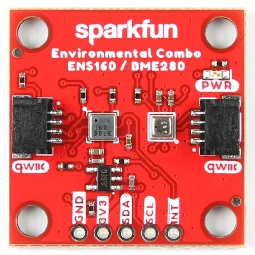

.. _sparkfun_environmental_combo:

Sparkfun Environmental Combo Shield with ENS160 and BME280
##########################################################

Overview
********

The `Sparkfun Environmental Combo Shield`_ features
a `ScioSense ENS160 Digital Metal Oxide Multi-Gas Sensor`_,
a `Bosch BME280 Humidity Sensor`_ and two Qwiic connectors.
It measures temperature, humidity, pressure, CO2 and
VOC (volatile organic compounds).

   Sparkfun Environmental Combo Shield (Credit: Sparkfun)

Requirements
************

This shield can be used with boards which provide an I2C connector, for
example STEMMA QT or Qwiic connectors.
The target board must define a ``zephyr_i2c`` node label.
See :ref:`shields` for more details.

Pin Assignments
===============

+--------------+---------------------------+
| Shield Pin   | Function                  |
+==============+===========================+
| SDA          | ENS160 and BME280 I2C SDA |
+--------------+---------------------------+
| SCL          | ENS160 and BME280 I2C SCL |
+--------------+---------------------------+
| INT          | ENS160 interrupt output   |
+--------------+---------------------------+

To use the interrupt output from the ENS160, you need to connect a wire from
the shield INT output to a suitable GPIO on your microcontroller board, and to
modify the devicetree settings. See :dtcompatible:`sciosense,ens160` for options.

See also :dtcompatible:`bosch,bme280` for the BME280 sensor.

Programming
***********

Set ``--shield sparkfun_environmental_combo`` when you invoke ``west build``. For example
when running the :zephyr:code-sample:`bme280` sample:

.. zephyr-app-commands::
   :zephyr-app: samples/sensor/bme280
   :board: adafruit_qt_py_rp2040
   :shield: sparkfun_environmental_combo
   :goals: build

You can also use the :zephyr:code-sample:`sensor_shell` sample:

.. zephyr-app-commands::
   :zephyr-app: samples/sensor/sensor_shell
   :board: adafruit_qt_py_rp2040
   :shield: sparkfun_environmental_combo
   :goals: build

.. _Sparkfun Environmental Combo Shield:
   https://www.sparkfun.com/sparkfun-environmental-combo-breakout-ens160-bme280-qwiic.html

.. _ScioSense ENS160 Digital Metal Oxide Multi-Gas Sensor:
   https://www.sciosense.com/wp-content/uploads/2023/12/ENS160-Datasheet.pdf

.. _Bosch BME280 Humidity Sensor:
   https://www.bosch-sensortec.com/products/environmental-sensors/humidity-sensors-bme280/
