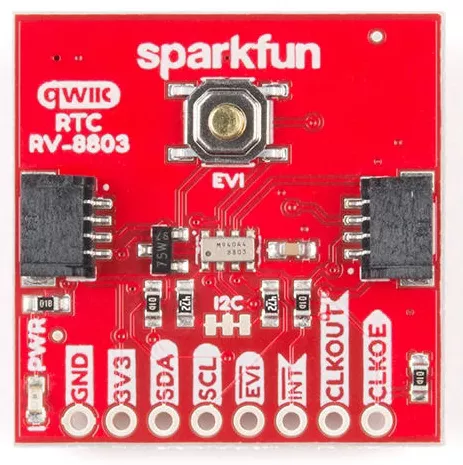

.. _sparkfun_rv8803:

Sparkfun RV8803 Shield
######################

Overview
********

The `SparkFun RV8803 Real Time Clock Shield`_ features
a `Micro Crystal RV-8803-C7 Real-Time-Clock`_ and two Qwiic connectors.
It has a 3 Volt back-up coin-cell battery.

   Sparkfun RV8803 Shield (Credit: Sparkfun)

Requirements
************

This shield can be used with boards which provide an I2C connector, for
example STEMMA QT or Qwiic connectors.
The target board must define a ``zephyr_i2c`` node label.
See :ref:`shields` for more details.

Pin Assignments
===============

+--------------+-------------------------------------------------------------------------------------------------+
| Shield Pin   | Function                                                                                        |
+==============+=================================================================================================+
| SDA          | RV8803 I2C SDA. Also connected to the Qwiic connector.                                          |
+--------------+-------------------------------------------------------------------------------------------------+
| SCL          | RV8803 I2C SCL. Also connected to the Qwiic connector.                                          |
+--------------+-------------------------------------------------------------------------------------------------+
| EVI          | RV8803 event input. Active low by default, with external pull-up and on-shield button.          |
+--------------+-------------------------------------------------------------------------------------------------+
| INT          | RV8803 interrupt output. Active low (open drain), with external pull-up.                        |
+--------------+-------------------------------------------------------------------------------------------------+
| CLKOUT       | RV8803 clock output. 32768, 1024 or 1 Hz (controlled by devicetree setting). Enabled by CLKOE.  |
+--------------+-------------------------------------------------------------------------------------------------+
| CLKOE        | RV8803 control of CLKOUT, which is enabled when this pin is high. External pull-down on shield. |
+--------------+-------------------------------------------------------------------------------------------------+

To use the interrupt output from the RV-8803, you need to connect a wire from
the shield INT output to a suitable GPIO on your microcontroller board, and to
modify the devicetree settings. See :dtcompatible:`microcrystal,rv8803` for options.

Programming
***********

Set ``--shield sparkfun_rv8803`` when you invoke ``west build``. For example
when running the :zephyr:code-sample:`rtc` sample:

.. zephyr-app-commands::
   :zephyr-app: samples/drivers/rtc
   :board: adafruit_qt_py_rp2040
   :shield: sparkfun_rv8803
   :goals: build

.. _SparkFun RV8803 Real Time Clock Shield:
   https://www.sparkfun.com/sparkfun-real-time-clock-module-rv-8803-qwiic.html

.. _Micro Crystal RV-8803-C7 Real-Time-Clock:
   https://www.microcrystal.com/en/products/real-time-clock-rtc-modules/rv-8803-c7
