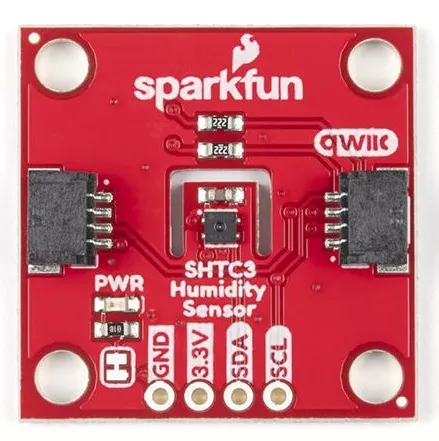

.. _sparkfun_shtc3:

Sparkfun SHTC3 Shield
#####################

Overview
********

The `Sparkfun SHTC3 Temperature and Humidity Sensor Shield`_ features
a `Sensirion SHTC3 Humidity and Temperature Sensor`_ and two Qwiic connectors.
It measures temperature and humidity.

   Sparkfun SHTC3 Shield (Credit: Sparkfun)

Requirements
************

This shield can be used with boards which provide an I2C connector, for
example STEMMA QT or Qwiic connectors.
The target board must define a ``zephyr_i2c`` node label.
See :ref:`shields` for more details.

Pin Assignments
===============

+--------------+-------------------+
| Shield Pin   | Function          |
+==============+===================+
| SDA          | SHTC3 I2C SDA     |
+--------------+-------------------+
| SCL          | SHTC3 I2C SCL     |
+--------------+-------------------+

See :dtcompatible:`sensirion,shtcx` for documentation on how to adjust the
devicetree file, if necessary.

Programming
***********

Set ``--shield sparkfun_shtc3`` when you invoke ``west build``. For example
when running the :zephyr:code-sample:`dht_polling` sample:

.. zephyr-app-commands::
   :zephyr-app: samples/sensor/dht_polling
   :board: adafruit_qt_py_rp2040
   :shield: sparkfun_shtc3
   :goals: build

.. _Sparkfun SHTC3 Temperature and Humidity Sensor Shield:
   https://www.sparkfun.com/sparkfun-humidity-sensor-breakout-shtc3-qwiic.html

.. _Sensirion SHTC3 Humidity and Temperature Sensor:
   https://sensirion.com/products/catalog/SHTC3
