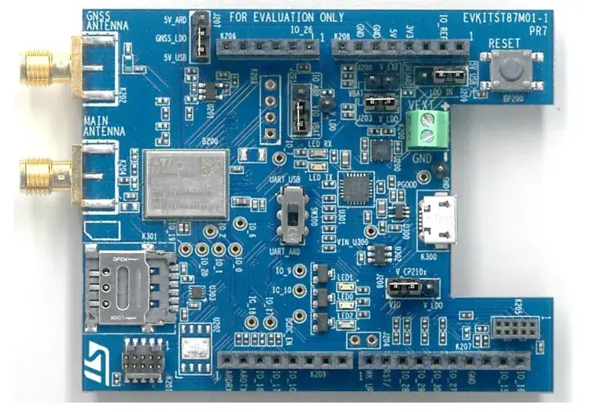

.. _st87mxx_generic:

ST87MXX shield
##############

Overview
********

The ST87M01 is a high-performance, fully programmable, ultra-compact,
and low-power LTE Cat NB2 NB-IoT industrial module series, offering
comprehensive worldwide band coverage and advanced security features.

Pins Assignment of the ST87MXX Shield
======================================

+-----------------------+------------------------+
| K207 Connector Pin    | Function               |
+=======================+========================+
| 1                     | MODEM_WAKE-UP          |
+-----------------------+------------------------+
| 2                     | MODEM_RESET            |
+-----------------------+------------------------+
| 7                     | GND                    |
+-----------------------+------------------------+

+-----------------------+------------------------+
| K208 Connector Pin    | Function               |
+=======================+========================+
| 4                     | 3V3                    |
+-----------------------+------------------------+
| 5                     | 5V0                    |
+-----------------------+------------------------+
| 6                     | GND                    |
+-----------------------+------------------------+
| 7                     | GND                    |
+-----------------------+------------------------+

+-----------------------+------------------------+
| K209 Connector Pin    | Function               |
+=======================+========================+
| 1                     | UART_RXD               |
+-----------------------+------------------------+
| 2                     | UART_TXD               |
+-----------------------+------------------------+

Requirements
************

This shield can only be used with a board that provides a configuration
for Arduino connectors and defines node aliases for UART and GPIO interfaces.

References
**********

.. target-notes::

.. _ST87MXX:
   https://www.st.com/en/wireless-connectivity/st87m01.html
