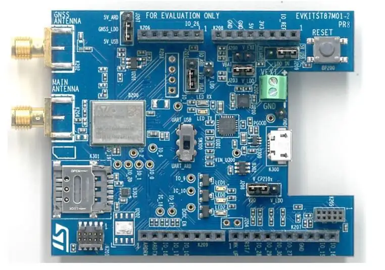

.. _st87mxx_generic:

ST87MXX shield
##############

Overview
********

The EVKITST87M01 is an evaluation board for the ST87M01 NB-IoT module.
It is designed as an X-NUCLEO Shield form factor with an Arduino
compatible connector.
Besides, two HOST connections to ST87M01 are possible:
a PC or associate board.

The ST87M01 is a high-performance, fully programmable, ultra-compact,
and low-power LTE Cat NB2 NB-IoT industrial module series, offering
comprehensive worldwide band coverage and advanced security features.

Features
========
Board connectors
 - USB connector
 - SMA RF antenna connector
 - SMA GNSS antenna connector
 - External power supply connector
 - Arduino connectors
 - HST (Trace) connector
 - Nano SIM card holder
 - JTAG CM4
3 power supply connection options
 - USB connector
 - External connector
 - Arduino connector
Interfaces
 - UART for AT commands
 - 2 x ADC
 - GPIOs
LEDs
 - 3 module activity LEDs
 - 2 UART activity LEDs
Button
 - 1 reset push-button

Pins Assignment of the EVKITST87M01
===================================
+-----------------------+------------------------+
| K207 Connector Pin    | Function               |
+=======================+========================+
| 1                     | MODEM_WAKE-UP          |
+-----------------------+------------------------+
| 2                     | MODEM_RESET            |
+-----------------------+------------------------+
| 7                     | GND                    |
+-----------------------+------------------------+

+-----------------------+------------------------+
| K208 Connector Pin    | Function               |
+=======================+========================+
| 4                     | 3V3                    |
+-----------------------+------------------------+
| 5                     | 5V0                    |
+-----------------------+------------------------+
| 6                     | GND                    |
+-----------------------+------------------------+
| 7                     | GND                    |
+-----------------------+------------------------+

+-----------------------+------------------------+
| K209 Connector Pin    | Function               |
+=======================+========================+
| 1                     | UART_RXD               |
+-----------------------+------------------------+
| 2                     | UART_TXD               |
+-----------------------+------------------------+

Requirements
************

This shield can only be used with a board that provides a configuration
for Arduino connectors and defines node aliases for UART and GPIO interfaces.

An NBIOT SIM, NanoSIM format, should be plugged in the SIM card holder
to enable modem network connection.

Build and Programming
*********************

To compile, set ``--shield st87mxx`` when you invoke ``west build``.

Then compile a sample, e.g.,

.. zephyr-app-commands::
   :zephyr-app: samples/net/sockets/http_client
   :board: your_board
   :shield: st87mxx
   :goals: build flash
   :compact:

References
**********

.. target-notes::

- https://www.st.com/en/evaluation-tools/evkitst87m01-2.html
