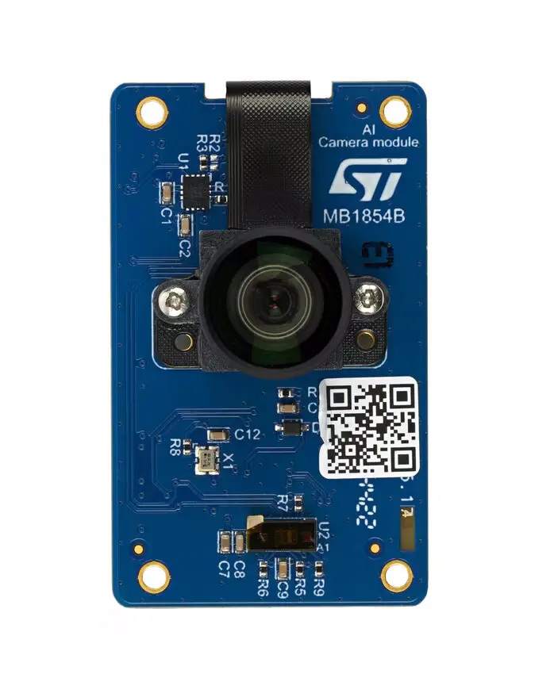

.. _st_b_cams_imx_mb1854:

ST B-CAMS-IMX-MB1854
####################

Overview
********

The B-CAMS-IMX camera module provides a compelling hardware set to
handle multiple computer vision scenarios and use cases. It features
a high-resolution 5‑Mpx RGB CMOS image sensor, an inertial motion unit,
and a Time‑of‑Flight sensor. It can be used with any STM32 boards featuring
a MIPI CSI-2® interface with a 22‑pin FFC connector to enable full-featured
computer vision on STM32 microcontrollers and microprocessors easily.

     B-CAMS-IMX MB1854 Image (Credit: STMicroelectronics.)

Requirements
************

The camera module bundle is compatible with all STM32 Discovery kits and
Evaluation boards featuring a 22 pins FFC connector, such as the STM32N6570_DK
Discovery kit.

Usage
*****

The shield can be used in any application by setting ``SHIELD`` to
``st_b_cams_imx_mb1854`` for boards with the necessary device tree node labels.

Set ``--shield "st_b_cams_imx_mb1854"`` when you invoke ``west build``. For example:

.. zephyr-app-commands::
   :zephyr-app: samples/drivers/video/capture
   :board: stm32n6570_dk
   :shield: st_b_cams_imx_mb1854
   :goals: build

References
**********

- `Product page <https://www.st.com/en/evaluation-tools/b-cams-imx.html>`_

- `Databrief <https://www.st.com/resource/en/data_brief/b-cams-imx.pdf>`_

- `User manual <https://www.st.com/resource/en/user_manual/um3354-camera-module-bundle-for-stm32-boards-stmicroelectronics.pdf>`_
