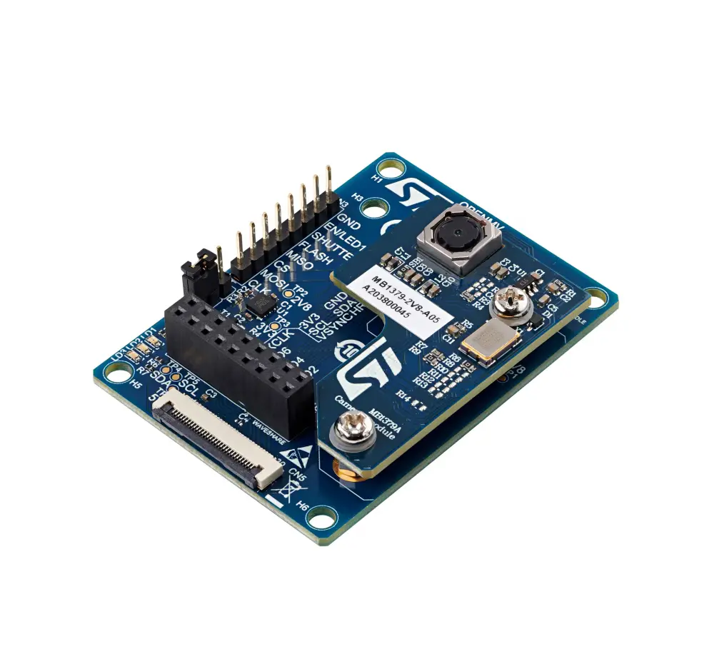

.. _st_b_cams_omv_mb1683:

ST B-CAMS-OMV-MB1683
####################

Overview
********

The camera module bundle (B-CAMS-OMV) provides extension connectors
for the MB1379 STMicroelectronics camera module daughterboard or
third-party modules like OpenMV and Waveshare modules. It can be used
with the STM32 boards featuring a 1 x 30 pin ZIF connector for the
connection of multiple cameras to implement computer vision on STM32
microcontrollers easily.

The camera module bundle is compatible with all STM32 Discovery kits and
Evaluation boards featuring a ZIF connector, such as the STM32H747I-DISCO,
STM32H7B3I-DK, and 32L4R9IDISCOVERY Discovery kits.

     B-CAMS-OMV MB1683 Image (Credit: STMicroelectronics.)

The camera signals go into the shield from one of the supported input
connectors (CN1, CN2, CN4), and out of the shield towards Zephyr through
the output 30-pin ZIF connector CN5.

Refer to the `User manual`_ for the pinout of CN1 and CN2.

Waveshare camera board connector CN4 (camera input)
***************************************************

+------------+-----------------+------------+--------------+
| Pin number | Description     | Pin number | Description  |
+============+=================+============+==============+
| 1          | GND             | 2          | VCAM         |
+------------+-----------------+------------+--------------+
| 3          | I2C_SDA         | 4          | I2C_SCL      |
+------------+-----------------+------------+--------------+
| 5          | DCMI_HSYNC      | 6          | DCMI_VSYNC   |
+------------+-----------------+------------+--------------+
| 7          | Camera_CLK      | 8          | DCMI_PIXCLK  |
+------------+-----------------+------------+--------------+
| 9          | DCMI_D6         | 10         | DCMI_D7      |
+------------+-----------------+------------+--------------+
| 11         | DCMI_D4         | 12         | DCMI_D5      |
+------------+-----------------+------------+--------------+
| 13         | DCMI_D2         | 14         | DCMI_D3      |
+------------+-----------------+------------+--------------+
| 15         | DCMI_D0         | 16         | DCMI_D1      |
+------------+-----------------+------------+--------------+
| 17         | PWR_EN / LED1   | 18         | RESET#       |
+------------+-----------------+------------+--------------+

ZIF connector CN5 (camera output)
*********************************

+------------+-----------------+
| Pin number | Description     |
+============+=================+
| 1          | 3V3             |
+------------+-----------------+
| 2          | GND             |
+------------+-----------------+
| 3          | I2C_SCL         |
+------------+-----------------+
| 4          | I2C_SDA         |
+------------+-----------------+
| 5          | RESET#          |
+------------+-----------------+
| 6          | PWR_EN / LED1   |
+------------+-----------------+
| 7          | SHUTTER         |
+------------+-----------------+
| 8          | GND             |
+------------+-----------------+
| 9          | PULLDOWN / LED2 |
+------------+-----------------+
| 10         | Camera_CLK      |
+------------+-----------------+
| 11         | 3V3             |
+------------+-----------------+
| 12         | DCMI_VSYNC      |
+------------+-----------------+
| 13         | 5V (RSU)        |
+------------+-----------------+
| 14         | DCMI_HSYNC      |
+------------+-----------------+
| 15         | GND             |
+------------+-----------------+
| 16         | DCMI_PIXCK      |
+------------+-----------------+
| 17         | GND             |
+------------+-----------------+
| 18         | SPI_MISO        |
+------------+-----------------+
| 19         | SPI_CS          |
+------------+-----------------+
| 20         | DCMI_D7         |
+------------+-----------------+
| 21         | DCMI_D6         |
+------------+-----------------+
| 22         | DCMI_D5         |
+------------+-----------------+
| 23         | DCMI_D4         |
+------------+-----------------+
| 24         | DCMI_D3         |
+------------+-----------------+
| 25         | DCMI_D2         |
+------------+-----------------+
| 26         | DCMI_D1         |
+------------+-----------------+
| 27         | DCMI_D0         |
+------------+-----------------+
| 28         | SPI_MOSI        |
+------------+-----------------+
| 29         | SPI_CLK         |
+------------+-----------------+
| 30         | GND             |
+------------+-----------------+

Requirements
************

The camera module bundle is compatible with all STM32 Discovery kits and
Evaluation boards featuring a ZIF connector, such as the STM32H747I-DISCO,
STM32H7B3I-DK, and 32L4R9IDISCOVERY Discovery kits.

Usage
*****

The shield can be used in any application by setting ``SHIELD`` to
``_st_b_cams_omv_mb1683`` and adding the necessary device tree properties.

Set ``--shield "st_b_cams_omv_mb1683"`` when you invoke ``west build``. For example:

.. zephyr-app-commands::
   :zephyr-app: samples/drivers/video/capture_to_lvgl
   :board: stm32h7b3i_dk
   :shield: st_b_cams_omv_mb1683
   :goals: build

References
**********

- `Product page <https://www.st.com/en/evaluation-tools/b-cams-omv.html>`_

- `Databrief <https://www.st.com/resource/en/data_brief/b-cams-omv.pdf>`_

- `User manual <https://www.st.com/resource/en/user_manual/um2779-camera-module-bundle-for-stm32-boards-stmicroelectronics.pdf>`_
