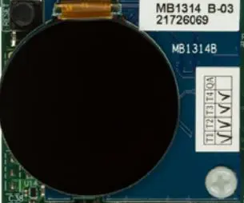

.. _st_b_dsi_mb1314:

ST B-DSI-MB1314
###############

Overview
********

This shield provides a DSI display, based on a round AMOLED touch-sensitive panel
of 1.2 inches and 390x390 pixels. The display module reference is IEG1120TB103GF-001
from Govisionox Optoelectronics. It displays up to 16M colors.

   B-DSI-MB1314 Image

Requirements
************

Your board needs to have ``zephyr_mipi_dsi`` and ``zephyr_lcd_controller``
device-tree labels to work with this shield.

Usage
*****

The shield can be used in any application by setting ``SHIELD`` to
``st_b_dsi_mb1314`` and adding the necessary board specific device tree
properties.

Set ``--shield "st_b_dsi_mb1314"`` when you invoke ``west build``. For example:

.. zephyr-app-commands::
   :zephyr-app: samples/drivers/display
   :board: stm32l4r9i_disco
   :shield: st_b_dsi_mb1314
   :goals: build

References
**********

- `Product page <https://www.st.com/en/evaluation-tools/32l4r9idiscovery.html>`_

- `User manual <https://www.st.com/resource/en/user_manual/um2271-discovery-kit-with-stm32l4r9ai-mcu-stmicroelectronics.pdf>`_
