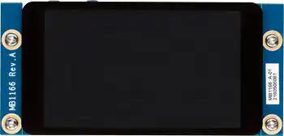
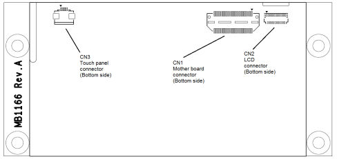

.. _st_b_lcd40_dsi1_mb1166_shield:

ST B-LCD40-DSI1
###############

Overview
********

The B-LCD40-DSI1 shield provides a 4-inch WVGA TFT LCD with MIPI DSI interface
and capacitive touch screen.

.. note::
   The shield comes in different hardware revisions, the MB1166-A09
   is utilizing a NT35510 panel controller and shall specifically
   use ``st_b_lcd40_dsi1_mb1166_a09`` as SHIELD when building
   Prior versions are utilizing an OTM8009a controller and shall
   use shield name without postfix, that is: ``st_b_lcd40_dsi1_mb1166``

   B-LCD40-DSI1 MB1166 Image

   B-LCD40-DSI1 MB1166 Connector

+------+--------------+------------+-------+--------------+-----------------+
| CN1  | Description  | Interface  | CN1   | Description  | Interface       |
| odd  |              |            | even  |              |                 |
+======+==============+============+=======+==============+=================+
| 1    | GND          | -          | 2     | -            | -               |
+------+--------------+------------+-------+--------------+-----------------+
| 3    | DSI_CK_P     | DSI        | 4     | TOUCH_INT    | Interrupt out   |
+------+--------------+------------+-------+--------------+-----------------+
| 5    | DSI_CK_N     | DSI        | 6     | -            | -               |
+------+--------------+------------+-------+--------------+-----------------+
| 7    | GND          | -          | 8     | -            | -               |
+------+--------------+------------+-------+--------------+-----------------+
| 9    | DSI_D0_P     | DSI        | 10    | -            | -               |
+------+--------------+------------+-------+--------------+-----------------+
| 11   | DSI_D0_N     | DSI        | 12    | -            | -               |
+------+--------------+------------+-------+--------------+-----------------+
| 13   | GND          | -          | 14    | -            | -               |
+------+--------------+------------+-------+--------------+-----------------+
| 15   | DSI_D1_P     | DSI        | 16    | -            | -               |
+------+--------------+------------+-------+--------------+-----------------+
| 17   | DSI_D1_N     | DSI        | 18    | -            | -               |
+------+--------------+------------+-------+--------------+-----------------+
| 19   | GND          | -          | 20    | -            | -               |
+------+--------------+------------+-------+--------------+-----------------+
| 21   | BLVDD(+5V)   | -          | 22    | -            | -               |
+------+--------------+------------+-------+--------------+-----------------+
| 23   | BLVDD(+5V)   | -          | 24    | -            | -               |
+------+--------------+------------+-------+--------------+-----------------+
| 25   | -            | -          | 26    | -            | -               |
+------+--------------+------------+-------+--------------+-----------------+
| 27   | BLGND        | -          | 28    | -            | -               |
+------+--------------+------------+-------+--------------+-----------------+
| 29   | BLGND        | -          | 30    | -            | -               |
+------+--------------+------------+-------+--------------+-----------------+
| 31   | -            | -          | 32    | -            | -               |
+------+--------------+------------+-------+--------------+-----------------+
| 33   | -            | -          | 34    | -            | -               |
+------+--------------+------------+-------+--------------+-----------------+
| 35   | -            | -          | 36    | VDD          | -               |
|      |              |            |       | (2.8V-3.3V)  |                 |
+------+--------------+------------+-------+--------------+-----------------+
| 37   | -            | -          | 38    | -            | -               |
+------+--------------+------------+-------+--------------+-----------------+
| 39   | -            | -          | 40    | I2C_SDA      | I2C             |
+------+--------------+------------+-------+--------------+-----------------+
| 41   | -            | -          | 42    | -            | -               |
+------+--------------+------------+-------+--------------+-----------------+
| 43   | -            | -          | 44    | I2C_SCL      | I2C             |
+------+--------------+------------+-------+--------------+-----------------+
| 45   | -            | -          | 46    | -            | -               |
+------+--------------+------------+-------+--------------+-----------------+
| 47   | -            | -          | 48    | -            | -               |
+------+--------------+------------+-------+--------------+-----------------+
| 49   | DSI_TE       | DSI        | 50    | -            | -               |
+------+--------------+------------+-------+--------------+-----------------+
| 51   | -            | -          | 52    | -            | -               |
+------+--------------+------------+-------+--------------+-----------------+
| 53   | BL_CTRL      | GPIO       | 54    | -            | -               |
+------+--------------+------------+-------+--------------+-----------------+
| 55   | -            | -          | 56    | -            | -               |
+------+--------------+------------+-------+--------------+-----------------+
| 57   | RESET        | GPIO       | 58    | -            | -               |
+------+--------------+------------+-------+--------------+-----------------+
| 59   | -            | -          | 60    | -            | -               |
+------+--------------+------------+-------+--------------+-----------------+

Requirements
************

Your board needs to have a ``mipi_dsi`` device tree label to work with this shield.

Usage
*****

The shield can be used in any application by setting ``SHIELD`` to
``st_b_lcd40_dsi1_mb1166`` or ``st_b_lcd40_dsi1_mb1166_a09`` and adding
the necessary device tree properties.

Set ``--shield "st_b_lcd40_dsi1_mb1166"`` when you invoke ``west build``. For example:

.. zephyr-app-commands::
   :zephyr-app: samples/drivers/display
   :board: stm32h747i_disco/stm32h747xx/m7
   :shield: st_b_lcd40_dsi1_mb1166
   :goals: build

References
**********

- `Product page <https://www.st.com/en/evaluation-tools/b-lcd40-dsi1.html>`_

- `Databrief <https://www.st.com/resource/en/data_brief/b-lcd40-dsi1.pdf>`_

- `User manual <https://www.st.com/resource/en/user_manual/um2104--4inch-wvga-tft-lcd-board-with-mipi-dsi-interface-and-capacitive-touch-screen-stmicroelectronics.pdf>`_
