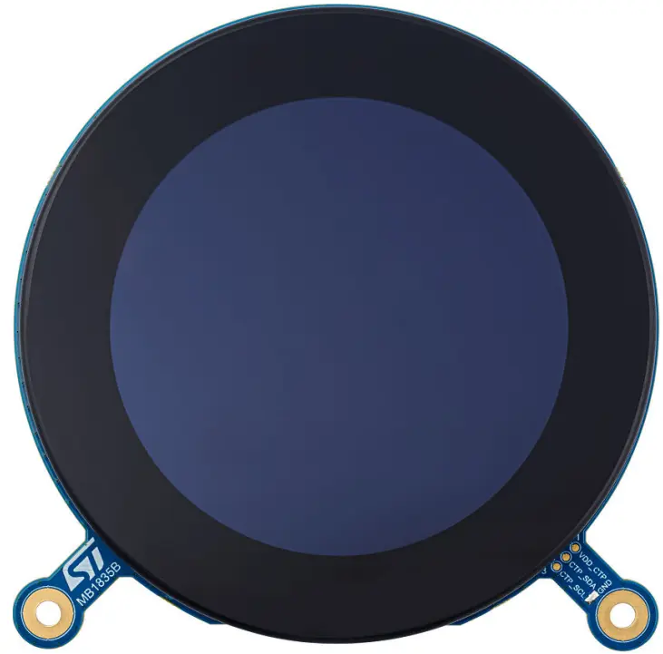
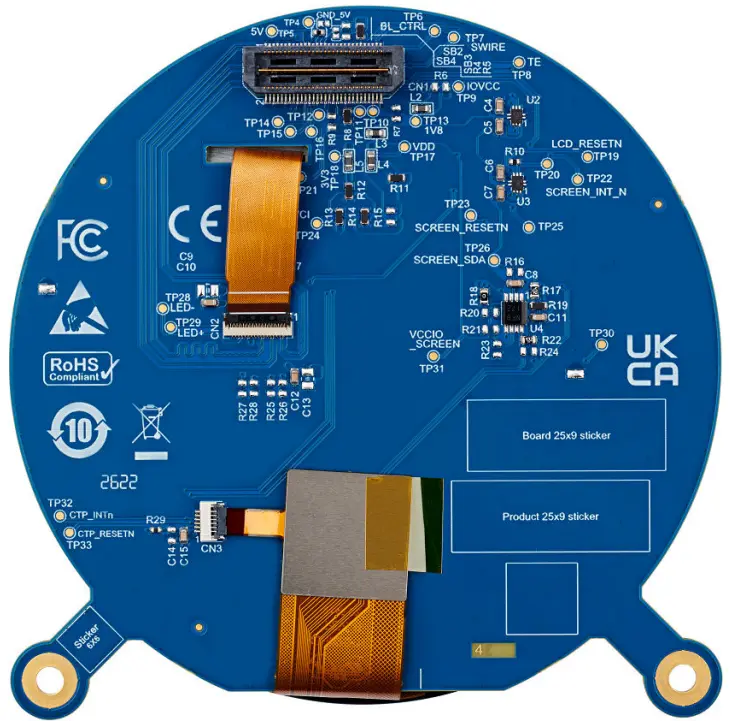

.. _st_lcd_dsi_mb1835:

ST LCD DSI MB1835
#################

Overview
********

The MB1835 shield (revision B-01) provides a 2.47-inch round TFT-LCD with MIPI DSI interface
and capacitive touch screen, specifically designed for STM32U5G9J-DK1 Discovery kit.

The shield features:

- 2.47-inch round TFT-LCD with 480x480 pixel resolution
- 16.7M color depth (RGB888)
- J025F1CN0201W display module with Himax HX8379C LCD controller
- MIPI DSI |reg| 2-data lane interface
- Capacitive touch panel (CTP)
- LED backlight with GPIO control

   MB1835 Display Shield Front Image

   MB1835 Display Shield Back Image

The MB1835 display board connects to the STM32U5G9J-DK1 through the CN1 connector:

+------+--------------+------------+-------+--------------+-----------------+
| CN1  | Description  | Interface  | CN1   | Description  | Interface       |
| odd  |              |            | even  |              |                 |
+======+==============+============+=======+==============+=================+
| 1    | GND          | -          | 2     | -            | -               |
+------+--------------+------------+-------+--------------+-----------------+
| 3    | DSI_CK_P     | DSI        | 4     | TOUCH_INT    | Interrupt out   |
+------+--------------+------------+-------+--------------+-----------------+
| 5    | DSI_CK_N     | DSI        | 6     | GND          | -               |
+------+--------------+------------+-------+--------------+-----------------+
| 7    | GND          | -          | 8     | -            | -               |
+------+--------------+------------+-------+--------------+-----------------+
| 9    | DSI_D0_P     | DSI        | 10    | -            | -               |
+------+--------------+------------+-------+--------------+-----------------+
| 11   | DSI_D0_N     | DSI        | 12    | GND          | -               |
+------+--------------+------------+-------+--------------+-----------------+
| 13   | GND          | -          | 14    | -            | -               |
+------+--------------+------------+-------+--------------+-----------------+
| 15   | DSI_D1_P     | DSI        | 16    | -            | -               |
+------+--------------+------------+-------+--------------+-----------------+
| 17   | DSI_D1_N     | DSI        | 18    | GND          | -               |
+------+--------------+------------+-------+--------------+-----------------+
| 19   | GND          | -          | 20    | -            | -               |
+------+--------------+------------+-------+--------------+-----------------+
| 21   | BLVDD(+5V)   | -          | 22    | -            | -               |
+------+--------------+------------+-------+--------------+-----------------+
| 23   | BLVDD(+5V)   | -          | 24    | -            | -               |
+------+--------------+------------+-------+--------------+-----------------+
| 25   | -            | -          | 26    | -            | -               |
+------+--------------+------------+-------+--------------+-----------------+
| 27   | BLGND        | -          | 28    | -            | -               |
+------+--------------+------------+-------+--------------+-----------------+
| 29   | BLGND        | -          | 30    | -            | -               |
+------+--------------+------------+-------+--------------+-----------------+
| 31   | -            | -          | 32    | -            | -               |
+------+--------------+------------+-------+--------------+-----------------+
| 33   | -            | -          | 34    | -            | -               |
+------+--------------+------------+-------+--------------+-----------------+
| 35   | -            | -          | 36    | 3.3V         | -               |
+------+--------------+------------+-------+--------------+-----------------+
| 37   | -            | -          | 38    | -            | -               |
+------+--------------+------------+-------+--------------+-----------------+
| 39   | -            | -          | 40    | I2C_SDA      | I2C             |
+------+--------------+------------+-------+--------------+-----------------+
| 41   | -            | -          | 42    | -            | -               |
+------+--------------+------------+-------+--------------+-----------------+
| 43   | -            | -          | 44    | I2C_SCL      | I2C             |
+------+--------------+------------+-------+--------------+-----------------+
| 45   | -            | -          | 46    | -            | -               |
+------+--------------+------------+-------+--------------+-----------------+
| 47   | -            | -          | 48    | -            | -               |
+------+--------------+------------+-------+--------------+-----------------+
| 49   | DSI_TE       | DSI        | 50    | -            | -               |
+------+--------------+------------+-------+--------------+-----------------+
| 51   | -            | -          | 52    | -            | -               |
+------+--------------+------------+-------+--------------+-----------------+
| 53   | BL_CTRL      | GPIO       | 54    | -            | -               |
+------+--------------+------------+-------+--------------+-----------------+
| 55   | -            | -          | 56    | -            | -               |
+------+--------------+------------+-------+--------------+-----------------+
| 57   | RESET        | GPIO       | 58    | -            | -               |
+------+--------------+------------+-------+--------------+-----------------+
| 59   | -            | -          | 60    | 1.8V         | -               |
+------+--------------+------------+-------+--------------+-----------------+

Requirements
************

Your board needs to have a ``mipi_dsi`` device tree label to work with this shield.

Usage
*****

The shield can be used in any application by setting ``SHIELD`` to
``st_lcd_dsi_mb1835`` and adding the necessary device tree properties.

Set ``--shield "st_lcd_dsi_mb1835"`` when you invoke ``west build``. For example:

.. zephyr-app-commands::
   :zephyr-app: samples/drivers/display
   :board: stm32u5g9j_dk1
   :shield: st_lcd_dsi_mb1835
   :goals: build

References
**********

- `STM32U5G9J-DK1 User Manual <https://www.st.com/resource/en/user_manual/um2967-discovery-kits-with-stm32u5x9nj-mcus-stmicroelectronics.pdf>`_

- `MB1835 Schematic (Rev B-01) <https://www.st.com/resource/en/schematic_pack/mb1835-vdd1v8-b01-schematic.pdf>`_
