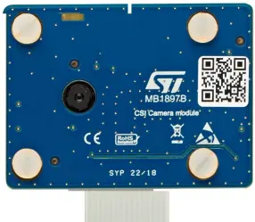

.. _st_mb1897_cam:

ST_MB1897_CAM
#############

Overview
********

The STM32MP135F discovery board is delivered with a CSI camera module
connected to the STM32MP135F-DK board via a 15pins FFC connector.
The camera module board (MB1897) embeds a Galaxycore GC2145 CSI sensor.

     MB1897 Image (Credit: STMicroelectronics.)

Requirements
************

The camera module bundle is compatible with STM32 Discovery kits and
Evaluation boards featuring a 15 pins FFC connector, such as the STM32MP13
Discovery kit.

Usage
*****

The shield can be used in any application by setting ``SHIELD`` to
``st_mb1897_cam`` for boards with the necessary device tree node labels.

Set ``--shield "st_mb1897_cam"`` when you invoke ``west build``. For example:

.. zephyr-app-commands::
   :zephyr-app: samples/drivers/video/capture
   :board: stm32mp135f_dk
   :shield: st_mb1897_cam
   :goals: build
