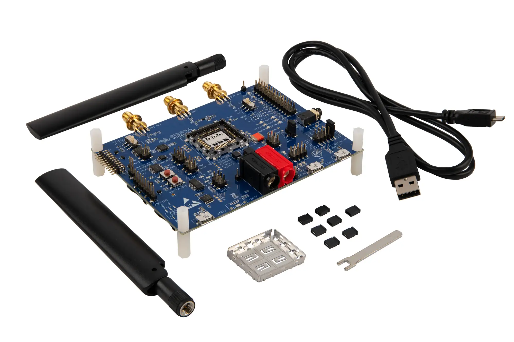

.. _swir_hl78xx_ev_kit:

HL/RC Module Evaluation Kit Shield
##################################

Overview
********

Welcome to the HL78 module getting started guide.
This guide will help you set up the evaluation kit (eval kit)
for sending AT commands to the HL78 module and initiating data transmission.

   HL/RC Module Evaluation Kit Shield Shield (Credit: Sierrra Wireless)

More information about the shield can be found at the `HL/RC Module Evaluation Kit Shield guide website`_.

Pins Assignment of HL/RC Module Evaluation Kit Shield Shield
============================================================
+--------------------------+----------------------------------------------------------+
| Shield Connector Pin     | Function                                                 |
+==========================+==========================================================+
| CN403 alias              | UART 1 (with CTS and RTS pins)                           |
+--------------------------+----------------------------------------------------------+
| CN303 alias              | SPI / UART 3                                             |
+--------------------------+----------------------------------------------------------+
| CN1000 alias             | GPIO Test Pins                                           |
+--------------------------+----------------------------------------------------------+
| GPIO6 CN1000_3           | LOW POWER MONITORING                                     |
+--------------------------+----------------------------------------------------------+
| VGPIO alias              | Indirect indicator of hibernate mode entry/exit          |
+--------------------------+----------------------------------------------------------+
| RESET CN1000_12          | RESET SIGNAL                                             |
+--------------------------+----------------------------------------------------------+
| WAKE-UP CN1000_8         | SPI / UART 3                                             |
+--------------------------+----------------------------------------------------------+

Please refer to the website for more information about HL/RC Module Evaluation Kit Shield Shield setup.
.. _HL/RC Module Evaluation Kit Shield guide website:

Checking Your Basic Configurations in PuTTY
===========================================
Before trying to set up a wired connection between the board and a host MCU,
it's a good idea to first go through this list of basic AT commands over a
USB COM port on a PC. For reference, you can find all the AT commands for the
HL78xx modules in the Source.

Requirements
************

This shield can be used with any boards which provides a configuration for
header connectors and defines node aliases for UART, SPI and USB interfaces (see
:ref:`shields` for more details).

Programming
***********

Set ``--shield swir_hl78xx_ev_kit`` when you invoke ``west build``. For
example:

.. zephyr-app-commands::
   :zephyr-app: samples/drivers/modem/hello_hl78xx
   :board: st/nucleo_u575zi_q
   :shield: swir_hl78xx_ev_kit
   :goals: build

References
**********

.. target-notes::

.. _HL/RC Module Evaluation Kit Shield guide website:
   https://source.sierrawireless.com/resources/airprime/development_kits/hl78xx-hl7900-development-kit-guide/

.. _HL/RC Module Evaluation Kit Shield specification website:
   https://info.sierrawireless.com/iot-modules-evaluation-kit#guide-for-the-hl78-series-evaluation-kit
