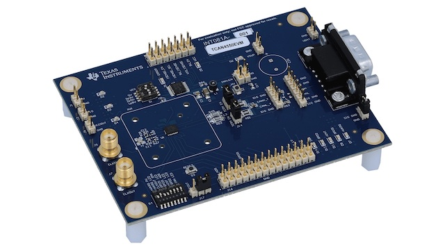

.. _tcan4550evm_shield:

Texas Instruments TCAN4550EVM
#############################

Overview
********

The Texas Instruments `TCAN4550EVM`_ features a `TI TCAN4550-Q1`_ automotive system basis chip (SBC)
with integrated CAN FD controller & transceiver.

   TCAN4550EVM (Credit: Texas Instruments)

Requirements
************

This shield can only be used with a board which provides a configuration for Arduino connectors and
defines node aliases for SPI and GPIO interfaces (see :ref:`shields` for more details).

.. note::

    This shield configuration limits the maximum SPI clock frequency to 2MHz although the
    TCAN4550-Q1 supports up to 18MHz SPI clock frequency. This is done to accommodate the flywires
    usually used for connecting the TCAN4550EVM to the board running Zephyr.

Pin Assignments
===============

+-----------------------+---------------------------------------------+
| Shield Connector Pin  | Function                                    |
+=======================+=============================================+
| D6                    | nWKRQ                                       |
+-----------------------+---------------------------------------------+
| D7                    | WAKE_LV                                     |
+-----------------------+---------------------------------------------+
| D8                    | RESET                                       |
+-----------------------+---------------------------------------------+
| D9                    | nINT                                        |
+-----------------------+---------------------------------------------+
| D10                   | nCS                                         |
+-----------------------+---------------------------------------------+
| D11                   | SDI                                         |
+-----------------------+---------------------------------------------+
| D12                   | SDO                                         |
+-----------------------+---------------------------------------------+
| D13                   | SCLK                                        |
+-----------------------+---------------------------------------------+

Programming
***********

Set ``--shield tcan4550evm`` when you invoke ``west build``. For example:

.. zephyr-app-commands::
   :zephyr-app: tests/drivers/can/api
   :board: frdm_k64f
   :shield: tcan4550evm
   :goals: build

.. _TCAN4550EVM:
   https://www.ti.com/tool/TCAN4550EVM

.. _TI TCAN4550-Q1:
   https://www.ti.com/product/TCAN4550-Q1
