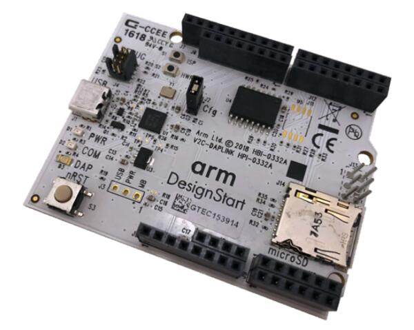

.. _v2c_daplink_shield:

ARM V2C-DAPLink for DesignStart FPGA
####################################

Overview
********

The `ARM V2C-DAPLink for DesignStart FPGA`_ shield can be used to provide
DAPLink debug access to the ARM DesignStart FPGA reference designs implemented
on the :ref:`arty`.

   V2C-DAPLink (Credit: ARM Ltd.)

In addition to DAPLink debug access, the V2C-DAPLink shield provides the
following hardware features:

- QSPI NOR flash
- Micro-SD card slot

Programming
***********

When using the V2C-DAPLink shield with the ``Cfg`` jumper (``J2``) open, the CPU
will boot from ITCM and flashing can be performed automatically. The console is
routed to USB connector ``J10`` on the :ref:`arty`. For example:

.. zephyr-app-commands::
   :zephyr-app: samples/hello_world
   :board: arty_a7_arm_designstart_m1
   :shield: v2c_daplink
   :goals: flash

When using the V2C-DAPLink shield with the ``Cfg`` jumper (``J2``) closed, the
CPU will boot from the V2C-DAPLink QSPI NOR flash. The console is routed to USB
connector ``J1`` on the V2C-DAPLink. Flashing needs to be done
manually by copying the resulting ``zephyr/zephyr.bin`` file to the USB mass
storage device provided by the V2C-DAPLink shield:

.. zephyr-app-commands::
   :zephyr-app: samples/hello_world
   :board: arty_a7_arm_designstart_m1
   :shield: v2c_daplink_cfg
   :goals: build

.. _ARM V2C-DAPLink for DesignStart FPGA:
   https://developer.arm.com/tools-and-software/development-boards/designstart-daplink-board
