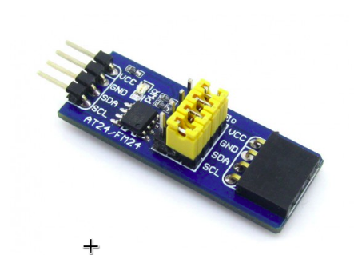

.. _waveshare_at24:

EEPROM AT24 Waveshare shield
############################

Overview
********

The Waveshare AT24CXX EEPROM boards is a development board for EEPROM with I2C interface. It is a non-volatile memory module. By using the onboard pinheader and female connector, several AT24CXX EEPROM Board can be cascaded on the I2C bus.

Requirements
************

This shield can only be used with a development board that provides a compatible female connector (e.g. :ref:`waveshare_open103z`).

Samples
*******

Zephyr RTOS does not include a sample application for this shield but any eeprom driver test application can be used for this purpose.

Programming
***********

Set ``-DSHIELD=waveshare_at24`` when you invoke ``west build``. For example:

.. zephyr-app-commands::
   :zephyr-app: test/drivers/eeprom
   :board: waveshare_open103z
   :shield: waveshare_at24
   :goals: build

.. _Waveshare AT24 web page:
   https://www.waveshare.com/wiki/AT24CXX_EEPROM_Board
