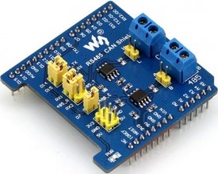
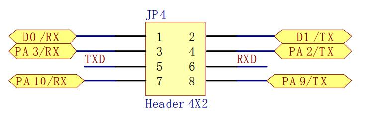
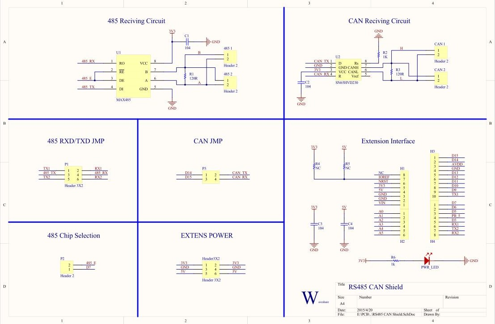

.. _waveshare_rs485_can:

WAVESHARE-RS485-CAN: RS485 CAN expansion board
##############################################

Overview
********
The RS485 CAN Shield will easily enable RS485/CAN communication functions for
NUCLEO/XNUCLEO Arduino boards.

 - Compatible with the ST Morpho and Arduino UNO R3
 - RS485 function, onboard transceiver SP3485/MAX3485, 3.3V power supply
 - CAN function, onboard transceiver SN65HVD230, 3.3V power supply

.. note::

   The Arduino-compatible board MUST be using 3.3V TTL logic levels for this shield to work.

More information about the board can be found at the
`WAVESHARE-RS485-CAN website`_.

Hardware configuration
**********************

THe WAVESHARE-RS485-CAN has following configuration for jumper settings:

 - D14 (PB_9) and D15 (PB_8) are CAN's sending and receiving ports respectively
   as default.
 - D7(PA_8) is for RS485 sending or receiving enable. The high level is for
   sending, low level is for receiving.
 - D8(PA_9), D2(PA_10) are the sending and receiving port of first UART.
 - D0(PA_2), and D1(PA_3) are the sending and receiving ports of second UART.
   You can choose first ore second UART for the RS485 transceiver port by
   setting jumper 485 RXD/TXD JMP.

.. note::

   PA_2 and PA_3 of Xnucleo are Serial to USB ports as default. If you want to
   use D0 and D1 as RS485 serial ports, the jumper JP4 should be set:
   connect pin 1 and pin 3, and connect pin 2 and pin 4.

STM32 Pin Connection:

+--------+--------------+-------------------------------------------+
| Shield | STM32-Nucleo | Function                                  |
+========+==============+===========================================+
| VCC    | 3.3V         | Power Input                               |
+--------+--------------+-------------------------------------------+
| GND    | GND          | Ground                                    |
+--------+--------------+-------------------------------------------+
| D2     | PA10         | RS485 Receiving Terminal                  |
+--------+--------------+-------------------------------------------+
| D8     | PA9          | RS485 Sending Terminal                    |
+--------+--------------+-------------------------------------------+
| D7     | PA8          | RS485 Sending & Receiving Enable Terminal |
+--------+--------------+-------------------------------------------+
| D14    | PB9          | CAN Sending Terminal                      |
+--------+--------------+-------------------------------------------+
| D15    | PB8          | CAN Receiving Terminal                    |
+--------+--------------+-------------------------------------------+

You could check `WAVESHARE-RS485-CAN User Manual`_ for more details.

Hardware
********

WAVESHARE-RS485-CAN contains in total two bus transceivers:

- MAX485 for RS485 communication with up to 2.5 Mbps data rate
- SN65HVD230 for CAN communication for up to 1 Mbps and supports ISO 11892-2
  High Speed CAN Physical Layer standard (transceiver)

Both mentioned ICs are just transcievers and do not have ability to manage
connection.

Following picture shows schematic of WAVESHARE-RS485-CAN:

More information about WAVESHARE-RS485-CAN can be found in
`WAVESHARE-RS485-CAN User Manual`_

Programming
***********

You can use the WAVESHARE-RS485-CAN as a CAN/RS485 transcievers shield.
Activate the presence of the shield for the project build by adding the
``-DSHIELD`` arg to the build command:

 .. zephyr-app-commands::
    :zephyr-app: your_app
    :board: your_board_name
    :shield: waveshare_rs485_can
    :goals: build

Alternatively, set use of this shield in the project's ``CMakeLists.txt`` file:

.. code-block:: cmake

	set(SHIELD waveshare_rs485_can)

References
**********

.. target-notes::

.. _WAVESHARE-RS485-CAN website:
   https://www.waveshare.com/wiki/RS485_CAN_Shield

.. _WAVESHARE-RS485-CAN User Manual:
   https://files.waveshare.com/upload/1/1a/RS485-CAN-Shield-User-Manual.pdf
