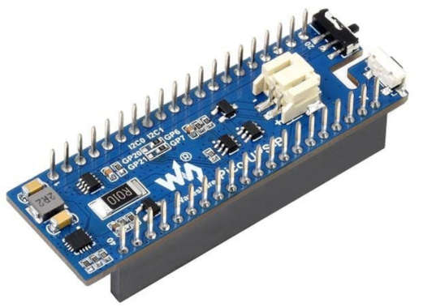

.. _waveshare_pico_ups_b_shield:

Waveshare Pico UPS-B shield
###########################

Overview
********

The Waveshare Pico UPS-B shield is an uninterruptible Power supply (UPS)
module designed for the Raspberry Pi Pico which uses the Texas Instruments' INA219
current/power Monitor. It communicates with the Raspberry Pi Pico over I2C

   Waveshare Pico UPS-B shield

Hardware
--------

- INA219

        - Senses bus voltages from 0 to 26 V
        - Reports current, voltage and power
        - 16 Programmable Addresses
        - SOT23-8 and SOIC-8 packages
        - Calibration registers

- ETA6003

        - Switching charger with power path management
        - Up to 95% DC-DC efficiency
        - 0mΩ power path MOSFET
        - Up to 2.5A max charging current

- Connectivity

        - Raspberry Pi Pico compatible (I2C)
        - 2 pin jst header for Li-po battery

-------+-----------------------+---------------------------+
| Name  | Function              | Usage                     |
+=======+=======================+===========================+
| GP0   | None                  |                           |
+-------+-----------------------+---------------------------+
| GP1   | None                  |                           |
+-------+-----------------------+---------------------------+
| GP2   | None                  |                           |
+-------+-----------------------+---------------------------+
| GP3   | None                  |                           |
+-------+-----------------------+---------------------------+
| GP4   | None                  |                           |
+-------+-----------------------+---------------------------+
| GP5   | None                  |                           |
+-------+-----------------------+---------------------------+
| GP6   | I2C1_SDA ACTIVE_LOW   | INA219                    |
+-------+-----------------------+---------------------------+
| GP7   | I2C1_SCL ACTIVE_LOW   | INA219                    |
+-------+-----------------------+---------------------------+
| GP8   | None                  |                           |
+-------+-----------------------+---------------------------+
| GP9   | None                  |                           |
+-------+-----------------------+---------------------------+
| GP10  | None                  |                           |
+-------+-----------------------+---------------------------+
| GP11  | None                  |                           |
+-------+-----------------------+---------------------------+
| GP12  | None                  |                           |
+-------+-----------------------+---------------------------+
| GP13  | None                  |                           |
+-------+-----------------------+---------------------------+
| GP14  | None                  |                           |
+-------+-----------------------+---------------------------+
| GP15  | None                  |                           |
+-------+-----------------------+---------------------------+
| GP16  | None                  |                           |
+-------+-----------------------+---------------------------+
| GP17  | None                  |                           |
+-------+-----------------------+---------------------------+
| GP18  | None                  |                           |
+-------+-----------------------+---------------------------+
| GP19  | None                  |                           |
+-------+-----------------------+---------------------------+
| GP20  | None                  |                           |
+-------+-----------------------+---------------------------+
| GP21  | None                  |                           |
+-------+-----------------------+---------------------------+
| GP22  | None                  |                           |
+-------+-----------------------+---------------------------+
| GP23  | None                  |                           |
+-------+-----------------------+---------------------------+
| GP24  | None                  |                           |
+-------+-----------------------+---------------------------+
| GP25  | None                  |                           |
+-------+-----------------------+---------------------------+
| GP26  | None                  |                           |
+-------+-----------------------+---------------------------+
| GP27  | None                  |                           |
+-------+-----------------------+---------------------------+
| GP28  | None                  |                           |
+-------+-----------------------+---------------------------+

- Power Supply

        - 3.3V ~ 5V

- Components

        - Power switch
        - Power LED
        - Charging LED

For more information about the Waveshare Pico UPS-B:

- `Waveshare Pico UPS website`_
- `INA219 data sheet`_
- `ETA6003 data sheet`_

Programming
***********

Set ``--shield waveshare_pico_ups_b`` when you invoke ``west build`` or ``cmake`` in your Zephyr application. For
example:

.. zephyr-app-commands::
   :zephyr-app: samples/sensor/ina219
   :tool: all
   :board: rpi_pico
   :shield: waveshare_pico_ups_b
   :goals: build flash

.. _Waveshare Pico UPS website:
   https://www.waveshare.com/wiki/Pico-UPS-B

.. _INA219 data sheet:
   https://www.ti.com/lit/ds/symlink/ina219.pdf

.. _ETA6003 data sheet:
   https://www.waveshare.com/w/upload/3/3f/ETA6003.pdf
