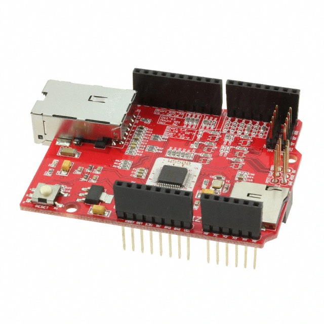

.. _wiznet_w5500:

WIZnet W5500 Ethernet Shield
############################

Overview
********

WIZnet `W5500 Ethernet Shield`_ is an Arduino connector shield designed using
the WIZnet W5500 chip. It supports both 3.3V & 5V operation and is compatible
with Arduino and ARM mbed platforms.

The shield features:

- `W5500`_ hardwired TCP/IP Ethernet controller with integrated 10/100 Ethernet
  MAC & PHY,
- 32 KiloBytes internal memory for socket buffers (8 independent sockets),
- SPI serial interface with speeds up to 80MHz,
- Full TCP/IP stack support (TCP, UDP, IPv4, ICMP, ARP, IGMP, PPPoE),
- Support Auto Negotiation (Full/Half duplex, 10/100-based),
- Wake-on-LAN (WOL) and Power Down Mode for energy efficiency,
- User-selectable GPIO pins for module stacking,
- Micro SD card slot with FAT16/FAT32 support,
- I2C interface,
- UART interface,
- RJ-45 connector with integrated transformer.

   WIZnet W5500 Ethernet Shield

Pins Assignment of the W5500 Shield
===================================

+-----------------------+---------------------------------------------+
| Shield Connector Pin  | Function                                    |
+=======================+=============================================+
| RST                   | Reset (Ethernet Shield and Arduino)         |
+-----------------------+---------------------------------------------+
| D2                    | Interrupt Output (default, with 2-3 short)  |
+-----------------------+---------------------------------------------+
| D10                   | SPI Chip Select (user-selectable)           |
+-----------------------+---------------------------------------------+
| D11                   | SPI MOSI (Master Out Slave In)              |
+-----------------------+---------------------------------------------+
| D12                   | SPI MISO (Master In Slave Out)              |
+-----------------------+---------------------------------------------+
| D13                   | SPI Clock (SCK)                             |
+-----------------------+---------------------------------------------+

.. note::
   The W5500 shield supports user-selectable GPIO configuration. The interrupt
   pin is configurable - by default it uses D2 (with pins 2-3 shorted), but can
   be reassigned to other Dx pins by soldering a 0R resistor to the desired pin.
   The chip select pin is also user-selectable for module stacking capability.

Requirements
************

This shield can only be used with a board that provides a configuration
for Arduino connectors and defines node aliases for SPI and GPIO interfaces
(see :ref:`shields` for more details).

.. note::
   When using with 5V platforms, the SD card may not operate stably. For secure
   SD card operation with 5V platforms, it is recommended to add a buffer and
   100nF capacitor.

Programming
***********

Set ``--shield wiznet_w5500`` when you invoke ``west build``. For example:

.. zephyr-app-commands::
   :zephyr-app: samples/net/dhcpv4_client
   :board: nrf52840dk/nrf52840
   :shield: wiznet_w5500
   :goals: build

References
**********

.. target-notes::

.. _W5500:
   https://wiznet.io/products/ethernet-chips/w5500

.. _W5500 Ethernet Shield:
   https://docs.wiznet.io/Product/Chip/Ethernet/W5500/W5500-Ethernet-Shield/w5500_ethernet_shield
