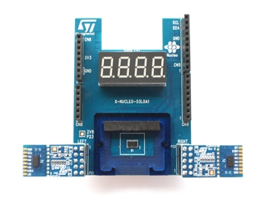

.. _x_nucleo_53l0a1_shield:

X-NUCLEO-53L0A1 ranging and gesture detection sensor expansion board
####################################################################

Overview
********

The X-NUCLEO-53L0A1 expansion board features the VL53L0X ranging and gesture
detection sensor, based on ST’s FlightSense™, Time-of-Flight technology. It is
an evaluation board that provides an introduction to the ranging and gesture
detection capabilities of the VL53L0X module.

One VL53L0X is soldered on the expansion board itself. A set of spacers and
a cover glass are provided with the board, and can be fitted onto this center
sensor.

Two VL53L0X satellites can be connected using the two 10 pin connectors.
The expansion board is compatible with the STM32 Nucleo board family,
and with the Arduino UNO R3 connector layout.

More information about the board can be found at the
`X-NUCLEO-53L0A1 website`_.

Requirements
************

This shield can only be used with a development board that provides a
configuration for Arduino connectors and defines a node alias for the
I2C interface (see :ref:`shields` for more details).

Peripherals
***********

The sensors have the following device tree labels and I2C addresses:

* **Center sensor** (soldered on the shield): ``VL53L0X_C``, 0x30
* **Left satellite sensor**: ``VL53L0X_L``, 0x31
* **Right satellite sensor**: ``VL53L0X_R``, 0x32

The 7 segment display is connected to two GPIO expanders, each of one handles
2 digits x 7 segments = 14 pins:

* **Rightmost two digits**: ``EXPANDER1``, 0x42
* **Leftmost two digits**: ``EXPANDER2``, 0x43

External links
**************

- `X-NUCLEO-53L0A1 ranging and gesture detection sensor expansion board User Manual`_
- `VL53L0X Time-of-Flight ranging and gesture detection sensor Datasheet`_

Samples
*******

The sample :zephyr:code-sample:`vl53l0x` demonstrates how to use the ranging sensor VL53L0X
using the center sensor only.

The sample :zephyr:code-sample:`x-nucleo-53l0a1` sample demonstrates how to use the three
sensors (soldered + 2 satellites) and the 7 segments display.

Programming
***********

Set ``--shield x_nucleo_53l0a1`` when you invoke ``west build``. For example:

.. zephyr-app-commands::
   :zephyr-app: samples/sensor/vl53l0x
   :board: nucleo_f429zi
   :shield: x_nucleo_53l0a1
   :goals: build

.. _X-NUCLEO-53L0A1 website:
   https://www.st.com/en/evaluation-tools/x-nucleo-53l0a1.html

.. _X-NUCLEO-53L0A1 ranging and gesture detection sensor expansion board User Manual:
   https://www.st.com/resource/en/user_manual/dm00285104-xnucleo53l0a1-ranging-and-gesture-detection-sensor-expansion-board-based-on-vl53l0x-for-stm32-nucleo-stmicroelectronics.pdf

.. _VL53L0X Time-of-Flight ranging and gesture detection sensor Datasheet:
   https://www.st.com/resource/en/datasheet/vl53l0x.pdf
