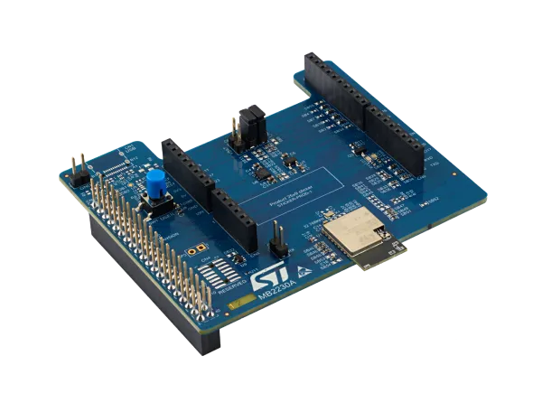

.. _x_nucleo_67w61m1:

X-NUCLEO-67W61M1: Wi-Fi 6 expansion board
#########################################

Overview
********
The X-NUCLEO-67W61M1 is a Wi-Fi 6 evaluation board based on the ST67W611M1
Wi-Fi coprocessor module to expand the STM32 Nucleo boards.

The X-NUCLEO-67W61M1 is compatible with the Arduino UNO R3 header, or
alternatively Raspberry Pi 40-pin GPIO header. It interfaces with the host
microcontroller via the default Arduino SPI pins, as well as D3, D5, D6 and
D10.

More information about the board can be found at the
`X-NUCLEO-67W61M1 website`_.

Features
********

X-NUCLEO-67W61M1 provides an ST67W611M1 chip with the following key features:

 - Wi-Fi 6 2.4 GHz
 - STA mode (SoftAP not yet supported by the Zephyr driver)
 - SPI communication (up to 40 MHz)

Coprocessor flashing
********************

Only the TCP/IP on-host architecture (T02) is supported. The use of external
tools included in the official `X-CUBE-ST67W61 Package`_ is necessary to flash
the correct firmware. Please refer to `ST67W611M1 Hardware setup`_ and
`X-CUBE-ST67W61 Architecture`_.

A flashing script is included in the X-CUBE package:

.. code-block:: shell

   cd x-cube-st67w61/Projects/ST67W6X_Scripts/Binaries/
   ./NCP_update_mission_profile_t02.sh

Programming
***********

Enable the shield for the project build by adding the ``--shield`` argument:

 .. zephyr-app-commands::
    :app: your_app
    :board: your_board_name
    :shield: x_nucleo_67w61m1
    :goals: build

For example, the zperf sample can be built with:

 .. zephyr-app-commands::
    :app: samples/net/zperf
    :board: your_board_name
    :shield: x_nucleo_67w61m1
    :goals: build
    :gen-args: -DEXTRA_CONF_FILE=boards/x_nucleo_67w61m1.conf

Improve performance
*******************

To reach better performance, the ST67W611M1 driver exploits, if available, the
DMA capabilities of the host. The DMA has to be configured in TX/RX mode. As
this is board specific, only a limited number of boards can make use of this
feature as-is. A specific Devicetree overlay has to be created for every board
at :file:`boards/shields/x_nucleo_67w61m1/boards/`. Therefore, this directory
also acts as the DMA compatibility list.

AT commands
***********

Internally, the host and ST67W611M1 communicate using AT commands for several
control and configuration functions. Refer to the
`ST67W611M1 AT commands doc`_.

References
**********

.. target-notes::

.. _X-NUCLEO-67W61M1 website:
   https://www.st.com/en/evaluation-tools/x-nucleo-67w61m1.html

.. _ST67W611M1 Hardware setup:
   https://wiki.st.com/stm32mcu/wiki/Connectivity:Wi-Fi_MCU_Hardware_Setup

.. _X-CUBE-ST67W61 Architecture:
   https://wiki.st.com/stm32mcu/wiki/Connectivity:X-CUBE-ST67W61_Architecture

.. _X-CUBE-ST67W61 Package:
   https://github.com/STMicroelectronics/x-cube-st67w61

.. _ST67W611M1 AT commands doc:
   https://applist67.github.io/Web_AT_Documentation_ST67/
