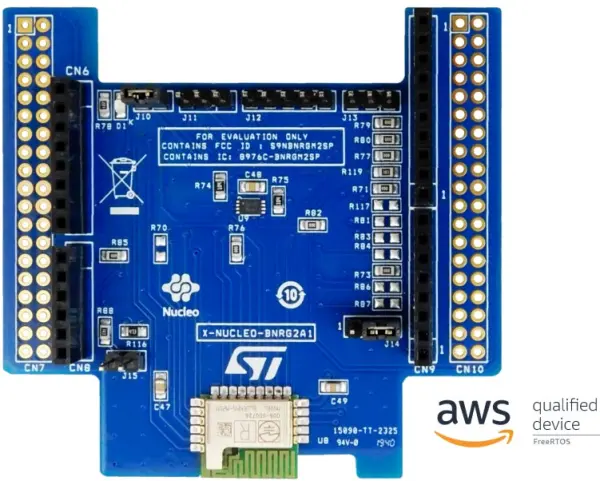

.. _x-nucleo-bnrg2a1:

X-NUCLEO-BNRG2A1: BLE expansion board
#####################################

Overview
********
The X-NUCLEO-BNRG2A1 is a Bluetooth Low Energy evaluation board based on the
BlueNRG-M2SP RF module to allow expansion of the STM32 Nucleo boards.
The BlueNRG-M2SP module is FCC (FCC ID: S9NBNRGM2SP) and IC certified
(IC: 8976C-BNRGM2SP).

The X-NUCLEO-BNRG2A1 is compatible with the ST Morpho and Arduino UNO R3
connector layout (the user can mount the ST Morpho connectors, if required). The
X-NUCLEO-BNRG2A1 interfaces with the host microcontroller via the SPI pins, and
the user can change the default SPI clock, the SPI chip select and SPI IRQ by
changing either one resistor or jumper on the evaluation board.

Note : This shield is compatible out of the box with Arduino UNO R3 connectors,
but CS signal is not the standard Arduino SPI_CS signal.
Please refer to "Hardware configuration" section.

More information about the board can be found at the
`X-NUCLEO-BNRG2A1 website`_.

Hardware configuration
**********************

Out of the box, X-NUCLEO-BNRG2A1 shield expects SPI CS to be available on
Arduino pin A1 instead of usual Arduino UNO R3 SPI CS D10.
This is not a problem as CS signal is software driven gpio on Arduino A1
see cs-gpios in x_nucleo_bnrg2a1.overlay

Shield configuration could be modified by moving resistors or changing jumper as
follows:

 - SPI SCK: to use D3 instead of D13, short J14 pins 2 and 3

Additionally, depending on your host board, some modifications of the BLE
expansion board could be made:

 - CS: To use D1 instead of A1, unmount R76 and mount R86

nucleo_l476rg does not need hardware modifications.

Hardware
********

X-NUCLEO-BNRG2A1 provides a BlueNRG-M2SP chip with the following key features:

 - Bluetooth v5.2 compliant
 - Embedded BALF-NRG-02D3 integrated matched balun with harmonic filter
 - BLE data packet length extension

More information about X-NUCLEO-BNRG2A1 can be found here:
       - `X-NUCLEO-BNRG2A1 databrief`_

Programming
***********

You can use the X-NUCLEO-BNRG2A1 as a Bluetooth Low-Energy controller
shield with an SPI host controller interface (HCI-SPI).  Activate the presence
of the shield for the project build by adding the ``--shield`` arg to the
build command:

 .. zephyr-app-commands::
    :zephyr-app: your_app
    :board: your_board_name
    :shield: x_nucleo_bnrg2a1
    :goals: build

Alternatively, set use of this shield in the project's ``CMakeLists.txt`` file:

.. code-block:: cmake

	set(SHIELD x_nucleo_bnrg2a1)

References
**********

.. target-notes::

.. _X-NUCLEO-BNRG2A1 website:
   https://www.st.com/en/ecosystems/x-nucleo-bnrg2a1.html

.. _X-NUCLEO-BNRG2A1 databrief:
   https://www.st.com/resource/en/data_brief/x-nucleo-bnrg2a1.pdf
