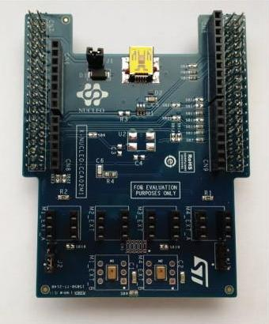

.. _x-nucleo-cca02m1:

X-NUCLEO-CCA02M1: Digital MEMS microphones shield for STM32 Nucleo
##################################################################

Overview
********
The X-NUCLEO-CCA02M1 is an evaluation board based on digital MEMS microphones
compatible with the ST morpho connector layout.
It has two microphones soldered onto the board and is compatible with digital microphone
coupon boards such as STEVAL-MKI129Vx and STEVAL-MKI155Vx.

The X-NUCLEO-CCA02M1 allows synchronized acquisition and streaming of up to 4
microphones through I2S, SPI or DFSDM peripherals.

For more information about the board, see the `X-NUCLEO-CCA02M1 website`_

Hardware
********

X-NUCLEO-CCA02M1 provides the following key features:

 - 2 x MP34DT01 on-board microphones
 - 4 x header (3x2) to connect up to 4 external microphones
 - Equipped with ST morpho connector
 - Equipped with Arduino UNO R3 connector
 - RoHS compliant

For more information about this shield, see the `X-NUCLEO-CCA02M1 data brief`_

Programming
***********

The X-NUCLEO-CCA02M1 can be connected to the SoC through I2S, SPI, or DFSDM peripherals,
but only I2S has been tested in Zephyr using a nucleo_f411re board.

References
**********

.. target-notes::

.. _X-NUCLEO-CCA02M1 website:
   https://www.st.com/en/ecosystems/x-nucleo-cca02m1.html

.. _X-NUCLEO-CCA02M1 data brief:
   https://www.st.com/resource/en/data_brief/x-nucleo-cca02m1.pdf

