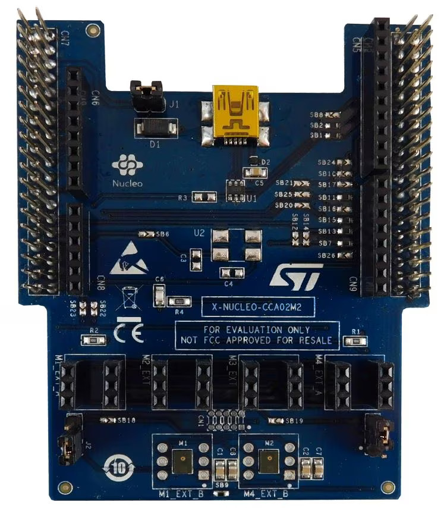

.. _x-nucleo-cca02m2:

X-NUCLEO-CCA02M2: Digital MEMS microphone shield
################################################

Overview
********
The X-NUCLEO-CCA02M2 expansion board has been designed around MP34DT06J digital
MEMS microphone.

It is compatible with the ST morpho connector layout and with digital
microphone coupon boards such as STEVAL-MIC001V1, STEVAL-MIC002V1 and
STEVAL-MIC003V1.

The X-NUCLEO-CCA02M2 embeds two MP34DT06J microphones and allows synchronized
acquisition and streaming of up to 4 microphones through I²S, SPI, DFSDM or SAI
peripherals.

It represents a quick and easy solution for the development of microphone-based
applications as well as a starting point for audio algorithm implementation.

More information about the board can be found at the
`X-NUCLEO-CCA02M2 website`_.

Hardware
********

X-NUCLEO-CCA02M2 provides the following key features:

 - 2 on-board MP34DT06J digital MEMS microphones
 - 6 slots to plug in digital microphone coupon boards such as STEVAL-MIC001V1,
   STEVAL-MIC002V1 and STEVAL-MIC003V1
 - Synchronized acquisition and streaming of up to 4 microphones
 - Free comprehensive development firmware library and audio capture plus USB
   streaming sample application compatible with STM32Cube
 - Compatible with STM32 Nucleo boards
 - Equipped with ST morpho connector (upwards and downwards)
 - Equipped with Arduino UNO R3 connector (upwards) to allow multiple boards
 - RoHS and WEEE compliant

More information about X-NUCLEO-CCA02M2 can be found here:

- `X-NUCLEO-CCA02M2 databrief`_

Hardware Configuration
**********************

The X-NUCLEO-CCA02M2 interfaces with the STM32 Nucleo microcontrollers via the
I²S, SPI, DFSDM or SAI peripherals for the synchronized acquisition of up to 4
microphones.  The board also provides USB streaming using the STM32 Nucleo
microcontroller USB peripheral: a USB connector is available together with the
footprint to mount a dedicated oscillator that can be used to feed the host MCU
through the OSC_IN pin.  Solder bridges allows choosing from different options,
depending on the number of microphones and the MCU peripherals involved.

A digital MEMS microphone can be acquired via different peripherals (SPI, I²S,
GPIO, SAI or DFSDM).  It requires an input clock to output a PDM stream at the
same frequency of the input clock.  The PDM stream is further filtered and
decimated for conversion into PCM standard for audio transmission.

Two different digital MEMS microphones can be connected on the same data line,
configuring the first one to generate valid data on the rising edge of the
clock and the other one on the falling edge, by setting the L/R pin of each
microphone accordingly.

On the X-NUCLEO-CCA02M2 expansion board two microphones share the same data
line.  Depending on the peripherals available on the host MCU, different
acquisition methods can be implemented to get microphone data as further
detailed in the following paragraphs.

DFSDM microphone acquisition
============================

The DFSDM peripheral generates the clock needed by the microphones and reads
the data on the rising and falling edges of each PDM line.

The acquired signals become an input to DSFDM filters for hardware filtering
and decimation to generate standard PCM streams.

An additional software high pass filtering stage removes any DC offset in the
output stream. DMA is used to reduce MCU load.

Please refer to the `X-NUCLEO-CCA02M2 databrief`_ for DFSDM solder bridge
configuration.

I²S and SPI microphone acquisition
==================================

In this scenario, I²S peripheral is used for the first and second microphone,
while SPI is adopted for the third and fourth one.

A precise clock signal is generated by the I²S peripheral while the SPI is
configured in slave mode and is fed by the same timing signal generated by I²S.
This clock is then halved by a timer and input to the microphones. The SPI and
I²S peripherals operate at twice the microphone frequency to read the data on
both the rising and falling edges of the microphone clock, thus reading the
bits of two microphones each.

A software demuxing step separates the signal from the two microphones and
allows further software processing; typically PDM to PCM conversion is
performed to transform PDM signals in the widely adopted and easy to manage PCM
format.

For further information regarding MEMS microphones acquisition and PDM to PCM
decimation, refer to AN5027 and UM2372 on www.st.com.

For single microphone acquisition, the microphone precise clock is generated
directly by I²S and one single microphone data line is read by the same
peripheral.

Please refer to the `X-NUCLEO-CCA02M2 databrief`_ for I²S solder bridge
configuration.

SAI microphone acquisition
==========================

Like DFSDM, the SAI peripheral with PDM interface is able to generate the
precise clock needed by the microphones and can read the data on the rising and
falling edges of each PDM line.

Unlike DFSDM, however, SAI cannot convert PDM to PCM in hardware, thus a
software step for the conversion is needed after data acquisition.

Please refer to the `X-NUCLEO-CCA02M2 databrief`_ for SAI solder bridge
configuration.

References
**********

.. target-notes::

.. _X-NUCLEO-CCA02M2 website:
   https://www.st.com/en/ecosystems/x-nucleo-cca02m2.html

.. _X-NUCLEO-CCA02M2 databrief:
   https://www.st.com/resource/en/data_brief/x-nucleo-cca02m2.pdf
