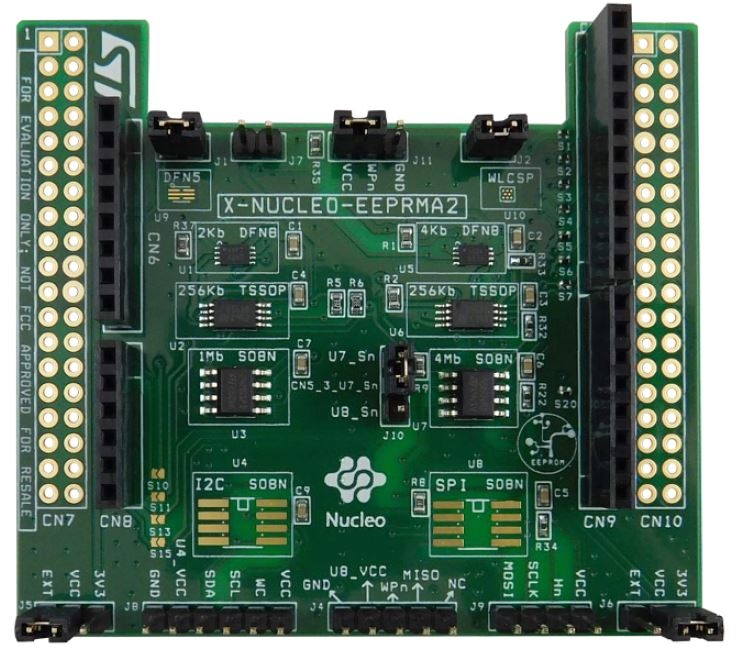

.. _x_nucleo_eeprma2_shield:

X-NUCLEO-EEPRMA2 EEPROM memory expansion board
##############################################

Overview
********

The ST X-NUCLEO-EEPRMA2 expansion board can be used to evaluate M24xx series I2C
and M95xx series SPI EEPROM devices.
The X-NUCLEO-EEPRMA2 expansion board is compatible with the Arduino UNO R3
connector pin assignment. Additionally the pins are routed to dedicated headers
and ST morpho connectors can be mounted if required.

The I2C EEPROMs are compatible with the ``atmel,at24`` driver and
the SPI EEPROMs are compatible with the ``atmel,at25`` driver.

More information about the board can be found at the
`X-NUCLEO-EEPRMA2 website`_.

Requirements
************

This shield can only be used with a development board that provides a
configuration for Arduino connectors and defines a node alias for the
SPI or I2C interface (see :ref:`shields` for more details).

The SPI EEPROM devices can write protect complete memory blocks by setting
the corresponding block protect bits in the status register.
As the driver does not change this status register, make sure this protections
are disabled in case writes to the EEPROM should be supported.

For more information about interfacing the M24xx and M95xx series EEPROM devices
and the X-NUCLEO-EEPRMA2 in particular, see these ST Microelectronics documents:

- `X-NUCLEO-EEPRMA2 EEPROM memory expansion board User Manual`_

- `M24C02-F Serial I2C bus EEPROM Datasheet`_
- `M24256-DF Serial I2C bus EEPROM Datasheet`_
- `M24M01-DF Serial I2C bus EEPROM Datasheet`_

- `M95040-R Serial SPI bus EEPROM Datasheet`_
- `M95256-DF Serial SPI bus EEPROM Datasheet`_
- `M95M04-DR Serial SPI bus EEPROM Datasheet`_

Samples
*******

The :zephyr:code-sample:`eeprom` sample can be used to demonstrate the expansion boards
functionality.
Per default the shield sets an ``eeprom-0`` alias for the M24C02-FMC6TG EEPROM,
which can be overwritten to use the other EEPROM devices instead.

Programming
***********

Set ``--shield x_nucleo_eeprma2`` when you invoke ``west build``. For example:

.. zephyr-app-commands::
   :zephyr-app: samples/drivers/eeprom/
   :board: nucleo_g0b1re
   :shield: x_nucleo_eeprma2
   :goals: build

.. _X-NUCLEO-EEPRMA2 website:
   https://www.st.com/en/evaluation-tools/x-nucleo-eeprma2.html

.. _X-NUCLEO-EEPRMA2 EEPROM memory expansion board User Manual:
   https://www.st.com/resource/en/user_manual/dm00671710-getting-started-with-the-xnucleoeeprma2-standard-ic-and-spi-eeprom-memory-expansion-board-based-on-m24xx-and-m95xx-series-for-stm32-nucleo-stmicroelectronics.pdf

.. _M24C02-F Serial I2C bus EEPROM Datasheet:
   https://www.st.com/resource/en/datasheet/m24c02-f.pdf

.. _M24256-DF Serial I2C bus EEPROM Datasheet:
   https://www.st.com/resource/en/datasheet/m24256-df.pdf

.. _M24M01-DF Serial I2C bus EEPROM Datasheet:
   https://www.st.com/resource/en/datasheet/m24m01-df.pdf

.. _M95040-R Serial SPI bus EEPROM Datasheet:
   https://www.st.com/resource/en/datasheet/m95040-r.pdf

.. _M95256-DF Serial SPI bus EEPROM Datasheet:
   https://www.st.com/resource/en/datasheet/m95256-df.pdf

.. _M95M04-DR Serial SPI bus EEPROM Datasheet:
   https://www.st.com/resource/en/datasheet/m95m04-dr.pdf
