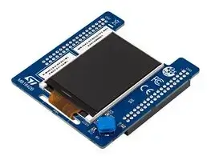

.. _x_nucleo_gfx01m2_shield:

X-NUCLEO-GFX01M2 Display expansion board
##############################################

Overview
********

The X-NUCLEO-GFX01M1 and X-NUCLEO-GFX01M2 expansion boards (X-NUCLEO-GFX01Mx)
add graphic user interface (GUI) capability to STM32 Nucleo-64 boards.
They feature a 2.2" SPI QVGA TFT display as well as a 64-Mbit SPI NOR Flash
memory for storing graphic images, texts and texture. The expansion boards
also offer a joystick for GUI navigation.

X-NUCLEO-GFX01M2 uses the ST morpho connector and supports up to two SPIs.

The SPI Display is compatible with the ``ilitek,ili9341`` driver and
the SPI FLASH is compatible with the ``jedec,spi-nor`` driver.

More information about the board can be found at the
`X-NUCLEO-GFX01M2 website`_.

Requirements
************

This shield can only be used with STM32 Nucleo-64 boards that provide
a configuration for ST Morpho connectors. This shield supports up to two SPIs.
Two node aliases for the LCD SPI and FLASH SPI are defined in the device tree
overlay that must reference the appropriate SPI controllers on the Nucleo
board. Consult the X-NUCLEO-GFX01M2 user manual for more information about the
SPI pinouts used on your development board:

- `X-NUCLEO-GFX01M2 SPI display expansion board User Manual`_

The SPI FLASH device does not support the Write Protection and Pause features.

For more information about interfacing the MX25L6433F FLASH device and the
ILI9341 display controller, see these documents:

- `ILI9341 Serial SPI bus TFT LCD Display Datasheet`_
- `MX25L6433F Serial SPI bus NOR FLASH Datasheet`_

Hardware configuration
**********************

The default SPI pin control of your development board may not be compatible
with the X-NUCLEO-GFX01M2 expansion board. Additionally, it is recommended
to configure the SPI pins to high speed and configure DMA channels for the
best graphics performance. See boards/nucleo_g071rb.overlay for an example
of how to do this.

Samples
*******

The :zephyr:code-sample:`display` and :zephyr:code-sample:`spi-nor` samples
can be used to test out the expansion boards functionality.

Programming
***********

Set ``--shield x_nucleo_gfx01m2`` when you invoke ``west build``. For example:

.. zephyr-app-commands::
   :zephyr-app: samples/drivers/display/
   :board: nucleo_g071rb
   :shield: x_nucleo_gfx01m2
   :goals: build

.. _X-NUCLEO-GFX01M2 website:
   https://www.st.com/en/evaluation-tools/x-nucleo-gfx01m2.html#overview

.. _X-NUCLEO-GFX01M2 SPI display expansion board User Manual:
   https://www.st.com/resource/en/user_manual/um2750-spi-display-expansion-boards-for-stm32-nucleo64-stmicroelectronics.pdf

.. _ILI9341 Serial SPI bus TFT LCD Display Datasheet:
   https://cdn-shop.adafruit.com/datasheets/ILI9341.pdf

.. _MX25L6433F Serial SPI bus NOR FLASH Datasheet:
   https://www1.futureelectronics.com/doc/Macronix/MX25L6433FZNI-08G.pdf
